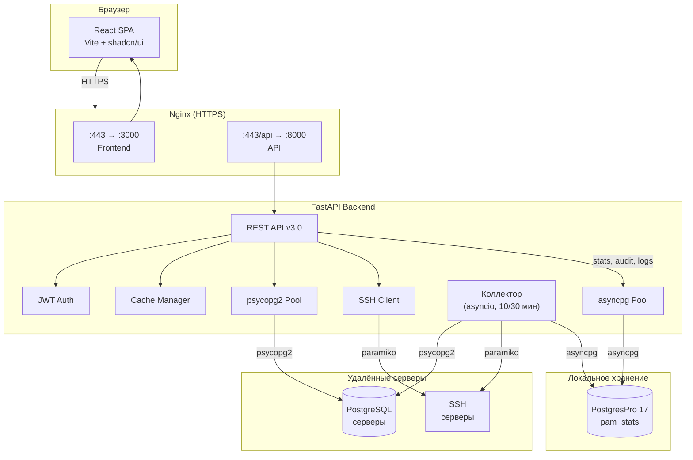
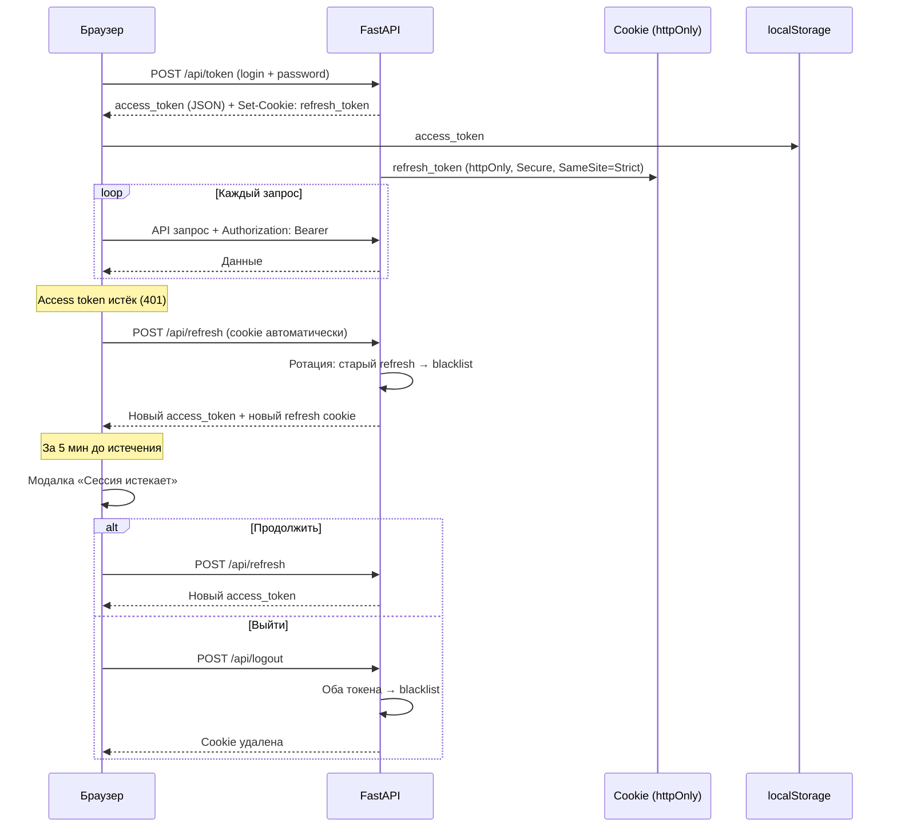
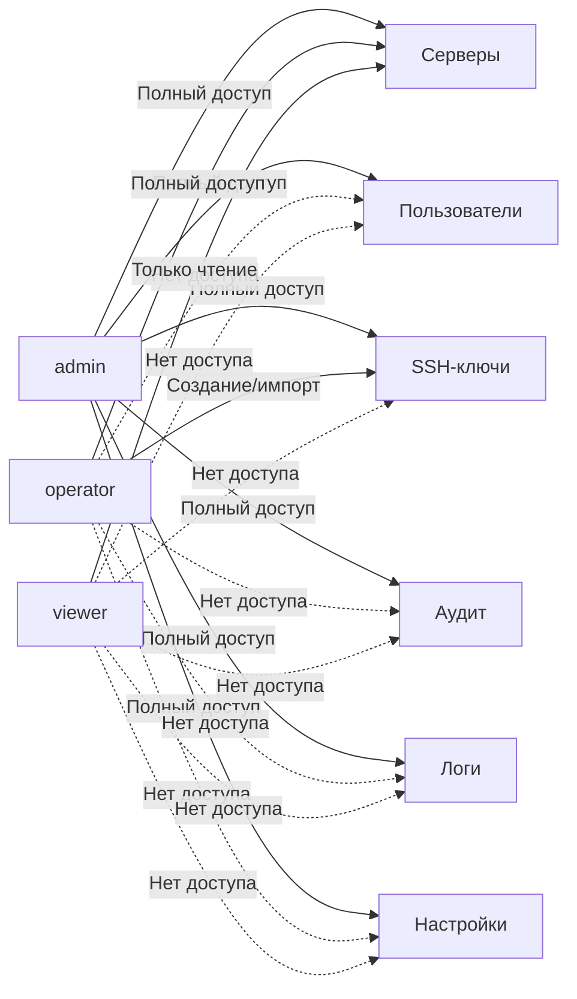

<div align="center">

# PostgreSQL Activity Monitor


**Система мониторинга PostgreSQL серверов с веб-интерфейсом, REST API и исторической статистикой**


</div>

---

## Возможности

<table>
<tr><td width="50%">

### Мониторинг
- **Серверы** — статус, версия PostgreSQL, uptime, активные соединения
- **Дисковое пространство** — свободное/занятое место через SSH
- **Историческая статистика** — автоматический сбор каждые 10 мин
- **Графики нагрузки** — подключения, размеры БД, транзакции
- **Анализ баз данных** — выявление неактивных, статичных и малоактивных БД

</td><td width="50%">

### Управление
- **Серверы** — добавление, редактирование, удаление, тест подключения (PG + SSH)
- **Пользователи** — ролевая модель (admin / operator / viewer)
- **SSH-ключи** — генерация (RSA, Ed25519), импорт, привязка к серверам
- **Настройки** — интервалы коллектора, сроки хранения данных
- **Аудит сессий** — журнал всех действий с фильтрами
- **Системные логи** — события коллектора, ошибки, предупреждения

</td></tr>
<tr><td>

### Безопасность
- **JWT авторизация** — access + refresh tokens, httpOnly cookies
- **CSRF-защита** — SameSite=Strict cookies + проверка Origin
- **Шифрование** — pgcrypto (PGP-AES256) для credentials в БД
- **Пароли** — bcrypt хэширование
- **Rate limiting** — защита от brute force (slowapi)
- **Security headers** — HSTS, X-Content-Type-Options, X-Frame-Options

</td><td>

### Интерфейс
- **Тёмная тема** — полная поддержка light/dark режимов
- **Command Palette** — быстрый поиск (`Ctrl+K`)
- **Responsive** — адаптивный Sidebar layout
- **Skeleton-загрузка** — плавная подгрузка контента
- **Toast-уведомления** — мгновенная обратная связь
- **Дизайн-система** — Steel Blue палитра, shadcn/ui компоненты

</td></tr>
</table>

---

## Архитектура



### Ключевые принципы

| Принцип | Реализация |
|---------|-----------|
| **Автосбор данных** | Коллектор v3 — бэкенд сам подключается к серверам по расписанию (asyncio loops) |
| **Единая БД** | Все данные (серверы, пользователи, ключи, статистика, аудит, логи) в PostgresPro |
| **Шифрование at rest** | Пароли и SSH-ключи зашифрованы pgcrypto (pgp_sym_encrypt) |
| **Connection pooling** | psycopg2 для удалённых серверов, asyncpg для локальной БД |
| **Кэширование** | Двухуровневое: статус серверов 5с, SSH 30с |
| **Партиционирование** | Таблица statistics партиционирована по месяцам |

---

## Поток авторизации



---

## Технологический стек

### Backend

| Технология | Версия | Назначение |
|-----------|--------|------------|
| Python | 3.13 | Среда выполнения |
| FastAPI | >=0.115 | REST API + автодокументация (Swagger / ReDoc) |
| Pydantic | >=2.10 | Валидация данных и сериализация |
| uvicorn | >=0.41 | ASGI-сервер |
| psycopg2-binary | >=2.9.10 | PostgreSQL драйвер (удалённые серверы, пулы) |
| asyncpg | >=0.30 | PostgreSQL async-драйвер (локальная БД pam_stats) |
| Paramiko | >=3.5 | SSH клиент (подключения, disk usage) |
| PyJWT | >=2.10 | JWT токены (access + refresh) |
| bcrypt | >=4.2 | Хэширование паролей |
| cryptography | >=46.0 | SSH-ключи (генерация RSA / Ed25519) |
| slowapi | >=0.1.9 | Rate limiting (защита от brute force) |
| python-dotenv | >=1.0 | Загрузка .env конфигурации |

### Frontend

| Технология | Версия | Назначение |
|-----------|--------|------------|
| React | 19.2 | UI-фреймворк (хуки, Context API) |
| Vite | 7.3 | Сборка и dev-сервер (HMR, ESBuild) |
| Tailwind CSS | 4.2 | Utility-first CSS, CSS-переменные, тёмная тема |
| shadcn/ui | 27 компонентов | UI-библиотека (Radix-примитивы + Tailwind) |
| Chart.js | 4.5 | Canvas-графики временных рядов |
| React Router | 7.13 | SPA-маршрутизация с защитой маршрутов |
| axios | 1.13 | HTTP клиент с JWT interceptors + auto-refresh |
| lucide-react | 0.575 | 1500+ SVG-иконок |
| Sonner | 2.0 | Toast-уведомления (success / error / info) |
| date-fns | 4.1 | Форматирование дат (локаль ru) |
| next-themes | 0.4 | Переключение light / dark темы |

### Инфраструктура

| Технология | Назначение |
|-----------|------------|
| PostgreSQL 9.6+ | Целевые серверы мониторинга |
| PostgresPro 1C 17 | Локальная БД (все данные приложения) |
| Nginx | Reverse proxy + SSL termination + Security headers + Gzip |
| systemd | Управление сервисами (pgmon-backend, pgmon-frontend) |

---

## Структура проекта

```
PostgreSQL-Activity-Monitor/
├── backend/                        # FastAPI REST API
│   ├── main.py                     # Точка входа, lifespan, CORS, rate limiting
│   ├── requirements.txt            # Python зависимости (диапазоны версий)
│   ├── pgmon-backend.service       # systemd сервис
│   ├── README.md                   # Документация backend
│   └── app/
│       ├── config.py               # Конфигурация: JWT, CORS, pools, collector
│       ├── api/                    # REST endpoints
│       │   ├── auth.py             # /api/token, /api/refresh, /api/logout
│       │   ├── servers.py          # CRUD /api/servers + test-ssh, test-pg
│       │   ├── stats.py            # Статистика серверов и БД
│       │   ├── users.py            # CRUD /api/users (admin)
│       │   ├── ssh_keys.py         # CRUD /api/ssh-keys (admin/operator)
│       │   ├── audit.py            # GET /api/audit/sessions (admin)
│       │   ├── logs.py             # GET /api/logs (admin)
│       │   ├── settings.py         # GET/PUT /api/settings (admin)
│       │   └── health.py           # /api/health, /api/pools/status
│       ├── auth/                   # JWT авторизация
│       │   ├── blacklist.py        # In-memory token blacklist (thread-safe)
│       │   ├── dependencies.py     # get_current_user (OAuth2 + JWT + blacklist)
│       │   └── utils.py            # Создание access/refresh токенов, пароли
│       ├── collector/              # Автосбор статистики (v3)
│       │   ├── scheduler.py        # 4 asyncio loops: stats, sizes, db_info, maintenance
│       │   └── tasks.py            # Логика сбора: pg_stat_database, sizes, disk, db_info
│       ├── database/
│       │   ├── pool.py             # DatabasePool (psycopg2, удалённые серверы)
│       │   ├── local_db.py         # asyncpg pool + DDL (локальная БД pam_stats)
│       │   └── repositories/       # async CRUD-репозитории (asyncpg + pgcrypto)
│       │       ├── user_repo.py    # Пользователи
│       │       ├── server_repo.py  # Серверы
│       │       ├── ssh_key_repo.py # SSH-ключи
│       │       └── settings_repo.py# Настройки
│       ├── models/                 # Pydantic v2 модели
│       │   ├── server.py           # Server
│       │   ├── user.py             # User, UserCreate, UserUpdate, UserRole
│       │   ├── ssh_key.py          # SSHKey, SSHKeyCreate, SSHKeyImport, SSHKeyType
│       │   └── audit.py            # AuditEvent
│       └── services/               # Бизнес-логика
│           ├── server.py           # load/save/update/delete серверов (asyncpg)
│           ├── ssh.py              # SSH подключения, disk usage (paramiko)
│           ├── cache.py            # CacheManager (thread-safe, TTL)
│           ├── user_manager.py     # CRUD пользователей (async, asyncpg)
│           ├── ssh_key_manager.py  # Генерация SSH-ключей (RSA, Ed25519)
│           ├── ssh_key_storage.py  # Хранение SSH-ключей (async, pgcrypto)
│           ├── audit_logger.py     # Аудит сессий и действий (asyncpg)
│           └── system_logger.py    # Системные логи коллектора (asyncpg)
│
├── frontend/                       # React SPA
│   ├── index.html                  # Точка входа HTML
│   ├── vite.config.js              # Конфигурация Vite (порт 3000, alias @/)
│   ├── components.json             # Конфигурация shadcn/ui
│   ├── package.json                # Node.js зависимости (v3.0.0)
│   ├── README.md                   # Документация frontend
│   └── src/
│       ├── main.jsx                # Точка входа React
│       ├── App.jsx                 # Роутинг, sidebar layout, модалы сессии
│       ├── index.css               # Tailwind + CSS-переменные (Steel Blue палитра)
│       ├── components/
│       │   ├── AppSidebar.jsx      # Боковая навигация (по ролям)
│       │   ├── CommandPalette.jsx  # Ctrl+K — быстрый поиск (cmdk)
│       │   ├── ErrorBoundary.jsx   # Обработка ошибок React
│       │   ├── Login.jsx           # Форма авторизации
│       │   ├── ServerList.jsx      # Главная — список серверов с фильтрами
│       │   ├── ServerDetails.jsx   # Детали сервера + анализ БД + графики
│       │   ├── ServerEdit.jsx      # Редактирование / добавление сервера
│       │   ├── DatabaseDetails.jsx # Графики: подключения, размер, коммиты
│       │   ├── UserManagement.jsx  # CRUD пользователей (admin)
│       │   ├── SSHKeyManagement.jsx# Генерация, импорт, управление SSH-ключами
│       │   ├── SessionAudit.jsx    # Журнал аудита сессий (admin)
│       │   ├── SystemLogs.jsx      # Системные логи коллектора (admin)
│       │   ├── Settings.jsx        # Настройки системы (admin)
│       │   ├── PageHeader.jsx      # Заголовок + breadcrumbs
│       │   ├── EmptyState.jsx      # Заглушка пустого состояния
│       │   ├── LoadingSpinner.jsx  # Индикатор загрузки (Loader2)
│       │   ├── ScrollToTop.jsx     # Кнопка «Наверх»
│       │   ├── skeletons/          # Skeleton-загрузка страниц
│       │   └── ui/                 # 27 shadcn/ui компонентов
│       ├── contexts/
│       │   ├── auth-context.jsx    # AuthProvider — JWT lifecycle, cookie refresh
│       │   └── servers-context.jsx # ServersProvider — глобальный список серверов
│       ├── hooks/
│       │   ├── use-auth.js         # useAuth() — доступ к AuthContext
│       │   ├── use-servers.js      # useServers() — доступ к ServersContext
│       │   └── use-mobile.js       # useMobile() — responsive breakpoint
│       └── lib/
│           ├── api.js              # Axios + JWT interceptors + auto-refresh queue
│           ├── chart-config.js     # Chart.js: цвета из CSS-переменных, градиенты
│           ├── constants.js        # Все константы приложения
│           ├── format.js           # Форматирование: bytes, uptime, даты, таймер
│           ├── validation.js       # Валидация: hostname, port
│           └── utils.js            # cn() — утилита CSS-классов (tailwind-merge)
│
├── docs/
│   └── DESIGN_SYSTEM.md            # Дизайн-система: палитра, компоненты, правила
│
├── .env                            # SECRET_KEY, ENCRYPTION_KEY, LOCAL_DB_DSN
├── .gitignore
├── CLAUDE.md                       # Инструкции для Claude Code
├── LICENSE                         # MIT
└── README.md                       # Этот файл
```

---

## Установка

### Требования

- Linux (Debian / Ubuntu / Astra Linux)
- Python 3.10+ (рекомендуется 3.13)
- Node.js 20+
- PostgreSQL 9.6+ на целевых серверах
- PostgreSQL / PostgresPro для локальной БД
- Nginx (для HTTPS)

### 1. Клонирование

```bash
git clone https://github.com/wobujidao/PostgreSQL-Activity-Monitor.git
cd PostgreSQL-Activity-Monitor
```

### 2. Локальная база данных

```bash
# Установите PostgreSQL (или PostgresPro) и создайте БД:
sudo -u postgres createuser pam
sudo -u postgres createdb -O pam pam_stats
sudo -u postgres psql -c "ALTER USER pam WITH PASSWORD 'pam';"
sudo -u postgres psql -d pam_stats -c "CREATE EXTENSION IF NOT EXISTS pgcrypto;"
```

### 3. Backend

```bash
cd backend
python3.13 -m venv venv
source venv/bin/activate
pip install --upgrade pip
pip install -r requirements.txt
```

### 4. Конфигурация

```bash
# Сгенерируйте ключи
SECRET=$(python3 -c 'import secrets; print(secrets.token_urlsafe(32))')
ENCKEY=$(python3 -c 'import secrets; print(secrets.token_urlsafe(32))')

cat > .env << EOF
SECRET_KEY=$SECRET
ENCRYPTION_KEY=$ENCKEY
LOCAL_DB_DSN=postgresql://pam:pam@/pam_stats?host=/tmp
EOF
```

### 5. Первый запуск и создание администратора

При первом запуске backend автоматически создаёт все таблицы в БД `pam_stats` (8 таблиц + партиции + индексы + расширение pgcrypto).

```bash
# Запустить backend
source venv/bin/activate
uvicorn main:app --host 0.0.0.0 --port 8000

# В другом терминале — создать администратора
cd backend && source venv/bin/activate
python3 -c "
import asyncio, bcrypt, asyncpg
async def main():
    pool = await asyncpg.create_pool('postgresql://pam:pam@/pam_stats?host=/tmp')
    pw = bcrypt.hashpw(b'admin', bcrypt.gensalt()).decode()
    await pool.execute(
        'INSERT INTO users (login, password_hash, role) VALUES (\$1, \$2, \$3) ON CONFLICT DO NOTHING',
        'admin', pw, 'admin'
    )
    print('Администратор создан (login: admin, password: admin)')
    await pool.close()
asyncio.run(main())
"
```

Серверы добавляются через веб-интерфейс или API.

### 6. Frontend

```bash
cd frontend
npm install
npm run dev       # Dev-сервер на порту 3000
```

### 7. Systemd сервисы

```bash
# Backend
sudo cp backend/pgmon-backend.service /etc/systemd/system/
sudo systemctl daemon-reload
sudo systemctl enable --now pgmon-backend

# Frontend
sudo systemctl enable --now pgmon-frontend

# Проверка
sudo systemctl status pgmon-backend pgmon-frontend
```

### 8. Nginx (HTTPS)

```nginx
server {
    listen 80;
    server_name your-domain.com;
    return 301 https://$server_name$request_uri;
}

server {
    listen 443 ssl;
    server_name your-domain.com;

    ssl_certificate /path/to/cert.crt;
    ssl_certificate_key /path/to/cert.key;

    # Security headers
    add_header Strict-Transport-Security "max-age=31536000; includeSubDomains" always;
    add_header X-Content-Type-Options "nosniff" always;
    add_header X-Frame-Options "SAMEORIGIN" always;
    add_header Referrer-Policy "strict-origin-when-cross-origin" always;

    # Gzip compression
    gzip on;
    gzip_types text/plain text/css application/json application/javascript text/xml application/xml;
    gzip_min_length 1000;

    # API — всё под /api/ идёт на backend
    location /api/ {
        proxy_pass http://127.0.0.1:8000/api/;
        proxy_http_version 1.1;
        proxy_set_header Host $host;
        proxy_set_header X-Real-IP $remote_addr;
        proxy_set_header X-Forwarded-For $proxy_add_x_forwarded_for;
        proxy_set_header X-Forwarded-Proto $scheme;
        proxy_set_header Authorization $http_authorization;
        proxy_set_header Cookie $http_cookie;
        proxy_set_header Content-Type $http_content_type;
        proxy_set_header Origin $http_origin;
    }

    # Фронтенд — всё остальное
    location / {
        proxy_pass http://127.0.0.1:3000;
        proxy_http_version 1.1;
        proxy_set_header Upgrade $http_upgrade;
        proxy_set_header Connection "upgrade";
        proxy_set_header Host $host;
        proxy_cache_bypass $http_upgrade;
        proxy_set_header X-Real-IP $remote_addr;
        proxy_set_header X-Forwarded-For $proxy_add_x_forwarded_for;
        proxy_set_header X-Forwarded-Proto $scheme;
    }
}
```

---

## API

Все endpoints находятся под префиксом `/api/`. Документация доступна по адресу `http://localhost:8000/docs` (Swagger UI) и `/redoc` (ReDoc).

> Все endpoints (кроме `/api/token` и `/api/health`) требуют JWT токен: `Authorization: Bearer <token>`

### Авторизация

| Метод | Endpoint | Описание |
|-------|----------|----------|
| POST | `/api/token` | Логин: access token + refresh cookie |
| POST | `/api/refresh` | Обновление access token (по refresh cookie) |
| POST | `/api/logout` | Выход: blacklist токенов + удаление cookie |

### Серверы

| Метод | Endpoint | Описание |
|-------|----------|----------|
| GET | `/api/servers` | Список серверов с текущим статусом |
| POST | `/api/servers` | Добавить сервер (с проверкой доступности) |
| PUT | `/api/servers/{name}` | Обновить сервер |
| DELETE | `/api/servers/{name}` | Удалить сервер (+ очистка исторических данных) |
| POST | `/api/servers/{name}/test-ssh` | Тест SSH подключения (пароль или ключ) |
| POST | `/api/servers/{name}/test-pg` | Тест PostgreSQL подключения (версия, соединения) |

### Статистика

| Метод | Endpoint | Описание |
|-------|----------|----------|
| GET | `/api/server_stats/{name}` | Активные запросы (pg_stat_activity) |
| GET | `/api/server/{name}/stats` | Историческая статистика сервера за период |
| GET | `/api/server/{name}/db/{db}` | Краткая информация о БД |
| GET | `/api/server/{name}/db/{db}/stats` | Детальная статистика БД за период |

### Пользователи (admin)

| Метод | Endpoint | Описание |
|-------|----------|----------|
| GET | `/api/users` | Список пользователей |
| POST | `/api/users` | Создать пользователя |
| GET | `/api/users/me` | Текущий пользователь |
| GET | `/api/users/{login}` | Информация о пользователе |
| PUT | `/api/users/{login}` | Обновить пользователя |
| DELETE | `/api/users/{login}` | Удалить пользователя |

### SSH-ключи (admin / operator)

| Метод | Endpoint | Описание |
|-------|----------|----------|
| GET | `/api/ssh-keys` | Список ключей |
| GET | `/api/ssh-keys/{id}` | Информация о ключе |
| POST | `/api/ssh-keys/generate` | Сгенерировать новый ключ (RSA / Ed25519) |
| POST | `/api/ssh-keys/import` | Импортировать ключ (текст) |
| POST | `/api/ssh-keys/import-file` | Импортировать ключ (файл) |
| PUT | `/api/ssh-keys/{id}` | Обновить имя / описание |
| DELETE | `/api/ssh-keys/{id}` | Удалить ключ |
| GET | `/api/ssh-keys/{id}/servers` | Серверы, использующие ключ |
| GET | `/api/ssh-keys/{id}/download-public` | Скачать публичный ключ |

### Аудит (admin)

| Метод | Endpoint | Описание |
|-------|----------|----------|
| GET | `/api/audit/sessions` | Журнал событий (фильтры: тип, пользователь, даты, IP, пагинация) |
| GET | `/api/audit/sessions/stats` | Статистика: входы сегодня, уникальные пользователи за неделю, действия |

### Системные логи (admin)

| Метод | Endpoint | Описание |
|-------|----------|----------|
| GET | `/api/logs` | Журнал системных событий (фильтры: level, source, даты, текст, пагинация) |
| GET | `/api/logs/stats` | Статистика: всего, ошибки сегодня, предупреждения сегодня |

### Настройки (admin)

| Метод | Endpoint | Описание |
|-------|----------|----------|
| GET | `/api/settings` | Все настройки с текущими значениями |
| PUT | `/api/settings` | Обновить настройки (с валидацией диапазонов) |

### Служебные

| Метод | Endpoint | Описание |
|-------|----------|----------|
| GET | `/api/health` | Состояние API: статус, версия, пулы (без авторизации) |
| GET | `/api/pools/status` | Детальный статус connection pools |
| GET | `/docs` | Swagger UI |
| GET | `/redoc` | ReDoc |

---

## База данных

Локальная БД `pam_stats` содержит 8 таблиц:

| Таблица | Описание | Особенности |
|---------|----------|-------------|
| `statistics` | Историческая статистика серверов | Партиционирована по месяцам (RANGE по ts) |
| `db_info` | Информация о базах данных | PK: server_name + datname |
| `users` | Пользователи системы | Роли: admin / operator / viewer |
| `servers` | Конфигурация серверов | Пароли зашифрованы pgcrypto |
| `ssh_keys` | SSH-ключи | Приватные ключи зашифрованы pgcrypto |
| `audit_sessions` | Аудит сессий и действий | Индексы: timestamp, username, event_type |
| `system_log` | Системные логи коллектора | Индексы: timestamp, level |
| `settings` | Настройки системы | KV-хранилище с типизацией |

---

## Конфигурация

### Переменные окружения (`.env`)

| Переменная | Обязательна | Описание |
|-----------|-------------|----------|
| `SECRET_KEY` | да | Ключ для подписи JWT токенов |
| `ENCRYPTION_KEY` | да | Ключ для pgcrypto (шифрование credentials) |
| `LOCAL_DB_DSN` | нет | DSN для локальной БД (по умолчанию: `postgresql://pam:pam@/pam_stats?host=/tmp`) |
| `LOG_LEVEL` | нет | Уровень логирования (по умолчанию: `INFO`) |
| `COLLECT_INTERVAL` | нет | Интервал сбора статистики в секундах (по умолчанию: `600`) |
| `SIZE_UPDATE_INTERVAL` | нет | Интервал обновления размеров БД (по умолчанию: `1800`) |
| `DB_CHECK_INTERVAL` | нет | Интервал проверки новых/удалённых БД (по умолчанию: `1800`) |
| `RETENTION_MONTHS` | нет | Хранить данные N месяцев (по умолчанию: `12`) |

### Настройки в БД (таблица `settings`)

Управляются через UI (`/settings`) или API (`PUT /api/settings`). Изменения применяются на следующем цикле коллектора.

| Ключ | По умолчанию | Описание |
|------|-------------|----------|
| `collect_interval` | 600 сек (10 мин) | Интервал сбора статистики |
| `size_update_interval` | 1800 сек (30 мин) | Интервал обновления размеров БД |
| `db_check_interval` | 1800 сек (30 мин) | Интервал проверки новых/удалённых БД |
| `retention_months` | 12 | Срок хранения статистики (месяцев) |
| `audit_retention_days` | 90 | Срок хранения аудита (дней) |
| `logs_retention_days` | 30 | Срок хранения системных логов (дней) |

### Константы (`backend/app/config.py`)

| Параметр | Значение | Описание |
|----------|----------|----------|
| `TOKEN_EXPIRATION` | 60 мин | Время жизни access token |
| `REFRESH_TOKEN_EXPIRATION_DAYS` | 7 дней | Время жизни refresh token |
| `AUDIT_RETENTION_DAYS` | 90 дней | Хранение записей аудита (fallback) |
| `SERVER_STATUS_CACHE_TTL` | 5 сек | TTL кэша статуса серверов |
| `SSH_CACHE_TTL` | 30 сек | TTL кэша SSH данных |
| `POOL_CONFIGS.default` | min=1, max=5 | Пул подключений (обычные серверы) |
| `POOL_CONFIGS.high_load` | min=5, max=20 | Пул подключений (нагруженные серверы) |

---

## Коллектор

Автономная подсистема сбора данных (v3). Запускается вместе с FastAPI как набор asyncio-задач.

### Циклы

| Цикл | Интервал | Действие |
|------|----------|----------|
| **stats_loop** | 10 мин | Сбор pg_stat_database + SSH disk usage со всех серверов |
| **sizes_loop** | 30 мин | Обновление размеров БД (pg_database_size) |
| **db_info_loop** | 30 мин | Синхронизация списка БД (новые / удалённые) |
| **maintenance_loop** | 24 ч | Очистка старых партиций, аудита и логов |

### Логирование

Все события коллектора записываются в таблицу `system_log` и доступны на странице `/logs`:
- **info** — успешный сбор, количество серверов, запуск/остановка
- **warning** — таймауты, недоступные серверы
- **error** — ошибки подключения, критические сбои

---

## Роли пользователей



| Роль | Серверы | Пользователи | SSH-ключи | Аудит | Логи | Настройки |
|------|---------|--------------|-----------|-------|------|-----------|
| **admin** | Полный | Полный | Полный | Чтение | Чтение | Полный |
| **operator** | Полный | — | Создание | — | — | — |
| **viewer** | Чтение | — | — | — | — | — |

---

## Использование

### CLI

```bash
# Получение токена
TOKEN=$(curl -s -X POST http://localhost:8000/api/token \
  -d "username=admin&password=admin" \
  -H "Content-Type: application/x-www-form-urlencoded" \
  | python3 -c "import sys,json; print(json.load(sys.stdin)['access_token'])")

# Список серверов
curl -H "Authorization: Bearer $TOKEN" http://localhost:8000/api/servers

# Активные запросы
curl -H "Authorization: Bearer $TOKEN" http://localhost:8000/api/server_stats/my-server

# Статистика за период
curl -H "Authorization: Bearer $TOKEN" \
  "http://localhost:8000/api/server/my-server/stats?start_date=2026-01-01&end_date=2026-02-01"

# Состояние API (без авторизации)
curl http://localhost:8000/api/health
```

### Swagger UI

Интерактивная документация: `http://localhost:8000/docs`

---

## Обслуживание

```bash
# Логи сервисов
sudo journalctl -u pgmon-backend -f
sudo journalctl -u pgmon-frontend -f

# Перезапуск
sudo systemctl restart pgmon-backend
sudo systemctl restart pgmon-frontend

# Обновление
git pull
cd backend && source venv/bin/activate && pip install -r requirements.txt
sudo systemctl restart pgmon-backend
cd ../frontend && npm install
sudo systemctl restart pgmon-frontend
```

---

## Лицензия

MIT License — см. файл [LICENSE](LICENSE).

## Автор

**Владислав Демидов** — [@wobujidao](https://github.com/wobujidao)
