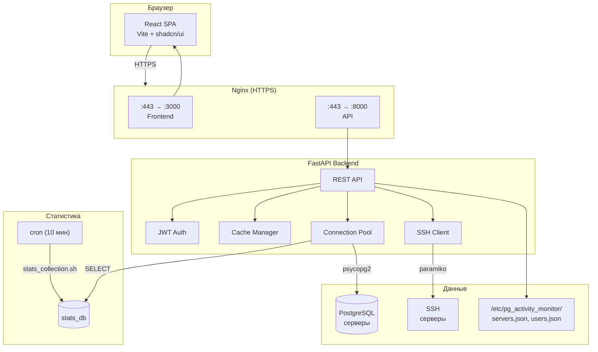
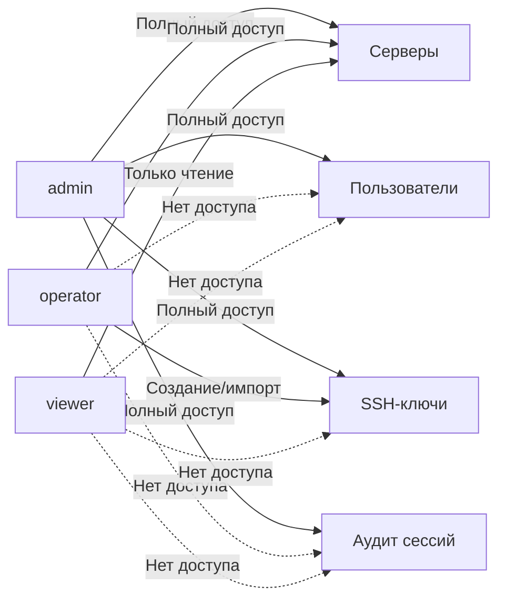

# PostgreSQL Activity Monitor

<div align="center">


**Система мониторинга PostgreSQL серверов с веб-интерфейсом, REST API и исторической статистикой**


</div>

---

## Возможности

- **Мониторинг серверов** — статус, версия, uptime, активные соединения, дисковое пространство
- **Историческая статистика** — графики нагрузки, размеров БД, транзакций за любой период
- **Анализ баз данных** — автоматическое выявление неактивных, статичных и малоактивных БД
- **SSH мониторинг** — свободное место на дисках через SSH (пароль или ключ)
- **Управление серверами** — добавление, редактирование, удаление через UI
- **Управление пользователями** — ролевая модель (admin / operator / viewer)
- **Управление SSH-ключами** — генерация, импорт, привязка к серверам
- **JWT авторизация** — access + refresh tokens, httpOnly cookies, token blacklist
- **CSRF-защита** — SameSite=Strict cookies + проверка Origin header
- **Аудит сессий** — журнал входов/выходов с IP, User-Agent, временем (admin)
- **Rate limiting** — защита от brute force (slowapi)
- **Тёмная тема** — полная поддержка light/dark режимов
- **Command Palette** — быстрый поиск (`Ctrl+K`)
- **Connection pooling** — переиспользование соединений к PostgreSQL
- **Кэширование** — двухуровневое (статус серверов 5с, SSH 30с)
- **Шифрование** — Fernet для хранения credentials, bcrypt для паролей

## Архитектура



## Поток авторизации


## Технологический стек

### Backend
| Технология | Версия | Назначение |
|-----------|--------|------------|
| Python | 3.13 | Среда выполнения |
| FastAPI | 0.129 | REST API фреймворк |
| Pydantic | 2.12 | Валидация данных |
| psycopg2 | 2.9 | PostgreSQL драйвер + connection pooling |
| Paramiko | 3.5 | SSH клиент |
| PyJWT + bcrypt | 2.11 / 4.3 | Авторизация |
| cryptography | 46.0 | Fernet шифрование |
| slowapi | 0.1.9 | Rate limiting (защита от brute force) |

### Frontend
| Технология | Версия | Назначение |
|-----------|--------|------------|
| React | 19.2 | UI фреймворк |
| Vite | 7.3 | Сборка и dev-сервер |
| Tailwind CSS | 4.2 | Utility-first CSS |
| shadcn/ui | 27 компонентов | UI-библиотека (Radix + Tailwind) |
| Chart.js | 4.5 | Графики временных рядов |
| React Router | 7.13 | SPA маршрутизация |
| axios | 1.13 | HTTP клиент с JWT interceptors |
| lucide-react | 0.575 | SVG иконки |

### Инфраструктура
| Технология | Назначение |
|-----------|------------|
| PostgreSQL 9.6+ | Целевые серверы мониторинга |
| Nginx | Reverse proxy + SSL termination |
| systemd | Управление сервисами |
| cron | Автоматический сбор статистики |

## Структура проекта

```
PostgreSQL-Activity-Monitor/
├── backend/                        # FastAPI REST API
│   ├── main.py                     # Точка входа
│   ├── requirements.txt            # Python зависимости
│   ├── pgmon-backend.service       # systemd сервис
│   ├── README.md                   # Документация backend
│   ├── USER_MANAGEMENT_API.md      # API управления пользователями
│   └── app/
│       ├── config.py               # Конфигурация (JWT, CORS, pools)
│       ├── api/                    # REST endpoints
│       │   ├── auth.py             # POST /token, /refresh, /logout
│       │   ├── servers.py          # CRUD /servers + test-ssh
│       │   ├── stats.py            # Статистика серверов и БД
│       │   ├── users.py            # CRUD /users (admin)
│       │   ├── ssh_keys.py         # CRUD /ssh-keys
│       │   ├── audit.py            # GET /audit/sessions (admin)
│       │   └── health.py           # /api/health, /api/pools/status
│       ├── auth/                   # JWT авторизация
│       │   ├── blacklist.py        # In-memory token blacklist
│       │   ├── dependencies.py     # get_current_user (OAuth2)
│       │   └── utils.py            # access/refresh токены, пароли
│       ├── database/
│       │   └── pool.py             # DatabasePool (ThreadedConnectionPool)
│       ├── models/                 # Pydantic v2 модели
│       │   ├── server.py           # Server
│       │   ├── user.py             # User, UserCreate, UserUpdate
│       │   ├── ssh_key.py          # SSHKey, SSHKeyCreate, SSHKeyImport
│       │   └── audit.py            # AuditEvent
│       ├── services/               # Бизнес-логика
│       │   ├── server.py           # Загрузка/сохранение серверов
│       │   ├── ssh.py              # SSH подключения, disk usage
│       │   ├── cache.py            # CacheManager (thread-safe, TTL)
│       │   ├── user_manager.py     # UserManager (bcrypt, fcntl)
│       │   ├── ssh_key_manager.py  # Генерация SSH ключей
│       │   ├── ssh_key_storage.py  # Хранение SSH ключей
│       │   └── audit_logger.py     # Аудит сессий (SQLite)
│       └── utils/
│           └── crypto.py           # Fernet шифрование/расшифровка
│
├── frontend/                       # React SPA
│   ├── index.html                  # Точка входа
│   ├── vite.config.js              # Конфигурация Vite
│   ├── components.json             # Конфигурация shadcn/ui
│   ├── package.json                # Node.js зависимости
│   ├── README.md                   # Документация frontend
│   └── src/
│       ├── main.jsx                # Точка входа React
│       ├── App.jsx                 # Роутинг, sidebar layout, модалы сессии
│       ├── index.css               # Tailwind + CSS-переменные (Steel Blue)
│       ├── components/
│       │   ├── AppSidebar.jsx      # Боковая навигация
│       │   ├── CommandPalette.jsx  # Ctrl+K поиск
│       │   ├── ErrorBoundary.jsx   # Обработка ошибок React
│       │   ├── Login.jsx           # Авторизация
│       │   ├── ServerList.jsx      # Список серверов (главная)
│       │   ├── ServerDetails.jsx   # Детали сервера + анализ БД
│       │   ├── ServerEdit.jsx      # Редактирование сервера
│       │   ├── DatabaseDetails.jsx # Статистика БД + графики
│       │   ├── UserManagement.jsx  # Управление пользователями
│       │   ├── SSHKeyManagement.jsx# Управление SSH-ключами
│       │   ├── SessionAudit.jsx   # Аудит сессий (admin)
│       │   ├── PageHeader.jsx      # Заголовок + breadcrumbs
│       │   ├── EmptyState.jsx      # Заглушка пустого состояния
│       │   ├── LoadingSpinner.jsx  # Индикатор загрузки
│       │   ├── ScrollToTop.jsx     # Кнопка «Наверх»
│       │   ├── skeletons/          # Skeleton-загрузка страниц
│       │   └── ui/                 # 27 shadcn/ui компонентов
│       ├── contexts/
│       │   ├── auth-context.jsx    # JWT lifecycle, cookie-based refresh
│       │   └── servers-context.jsx # Глобальный список серверов
│       ├── hooks/
│       │   ├── use-auth.js         # useAuth()
│       │   ├── use-servers.js      # useServers()
│       │   └── use-mobile.js       # useMobile() (responsive)
│       └── lib/
│           ├── api.js              # Axios + JWT interceptors + auto-refresh
│           ├── chart-config.js     # Chart.js: цвета, опции, градиенты
│           ├── constants.js        # Все константы приложения
│           ├── format.js           # Форматирование: bytes, uptime, даты
│           ├── validation.js       # Валидация: hostname, port
│           └── utils.js            # cn() для Tailwind классов
│
├── stats_db/                       # Сбор исторической статистики
│   ├── create_stats_db.sh          # Создание таблиц
│   ├── stats_collection.sh         # Скрипт сбора (cron)
│   └── README.md                   # Документация
│
├── docs/
│   └── DESIGN_SYSTEM.md            # Дизайн-система проекта
│
├── .env                            # SECRET_KEY
├── .gitignore
├── CLAUDE.md                       # Инструкции для Claude Code
├── LICENSE                         # MIT
└── README.md                       # Этот файл
```

## Установка

### Требования

- Linux (Debian / Ubuntu / Astra Linux)
- Python 3.10+ (рекомендуется 3.13)
- Node.js 20+
- PostgreSQL 9.6+ на целевых серверах
- Nginx (для HTTPS)

### 1. Клонирование

```bash
git clone https://github.com/wobujidao/PostgreSQL-Activity-Monitor.git
cd PostgreSQL-Activity-Monitor
```

### 2. Backend

```bash
cd backend
python3.13 -m venv venv
source venv/bin/activate
pip install --upgrade pip
pip install -r requirements.txt
```

### 3. Конфигурация

```bash
# Директория конфигурации
sudo mkdir -p /etc/pg_activity_monitor
sudo chown $USER:$USER /etc/pg_activity_monitor

# Ключ шифрования
python3 -c "from cryptography.fernet import Fernet; print(Fernet.generate_key().decode())" \
  > /etc/pg_activity_monitor/encryption_key.key
chmod 600 /etc/pg_activity_monitor/encryption_key.key

# SECRET_KEY для JWT
echo "SECRET_KEY=$(python3 -c 'import secrets; print(secrets.token_urlsafe(32))')" > .env
```

### 4. Создание администратора

```bash
python3 -c "
import bcrypt, json
password = input('Пароль для admin: ').encode()
hashed = bcrypt.hashpw(password, bcrypt.gensalt()).decode()
users = [{'login': 'admin', 'password': hashed, 'role': 'admin', 'is_active': True}]
with open('/etc/pg_activity_monitor/users.json', 'w') as f:
    json.dump(users, f, indent=2)
print('Пользователь admin создан')
"
```

### 5. Добавление серверов

Создайте `/etc/pg_activity_monitor/servers.json`:

```json
[
  {
    "name": "my-server",
    "host": "10.0.1.10",
    "port": 5432,
    "user": "postgres",
    "password": "password",
    "ssh_user": "pgadmin",
    "ssh_password": "ssh_password",
    "ssh_port": 22,
    "ssh_auth_type": "password",
    "stats_db": "stats_db"
  }
]
```

> Пароли будут автоматически зашифрованы при первом сохранении через API.

### 6. Frontend

```bash
cd frontend
npm install
```

### 7. Systemd сервисы

```bash
# Backend
sudo cp backend/pgmon-backend.service /etc/systemd/system/
sudo systemctl daemon-reload
sudo systemctl enable --now pgmon-backend

# Frontend
sudo systemctl enable --now pgmon-frontend

# Проверка
sudo systemctl status pgmon-backend pgmon-frontend
```

### 8. Nginx (HTTPS)

```nginx
server {
    listen 80;
    server_name your-domain.com;
    return 301 https://$server_name$request_uri;
}

server {
    listen 443 ssl;
    server_name your-domain.com;

    ssl_certificate /path/to/cert.crt;
    ssl_certificate_key /path/to/cert.key;

    # Frontend
    location / {
        proxy_pass http://127.0.0.1:3000;
        proxy_http_version 1.1;
        proxy_set_header Upgrade $http_upgrade;
        proxy_set_header Connection 'upgrade';
        proxy_set_header Host $host;
    }

    # Auth API
    location /token {
        proxy_pass http://127.0.0.1:8000/token;
        proxy_set_header Host $host;
        proxy_set_header X-Real-IP $remote_addr;
        proxy_set_header Content-Type $http_content_type;
    }

    location /refresh {
        proxy_pass http://127.0.0.1:8000/refresh;
        proxy_set_header Host $host;
        proxy_set_header X-Real-IP $remote_addr;
        proxy_set_header Cookie $http_cookie;
        proxy_set_header Origin $http_origin;
    }

    location /logout {
        proxy_pass http://127.0.0.1:8000/logout;
        proxy_set_header Host $host;
        proxy_set_header X-Real-IP $remote_addr;
        proxy_set_header Cookie $http_cookie;
        proxy_set_header Authorization $http_authorization;
    }

    # Data API
    location /api/ {
        proxy_pass http://127.0.0.1:8000/api/;
        proxy_set_header Host $host;
        proxy_set_header Authorization $http_authorization;
    }

    location ~ ^/(servers|users|ssh-keys|server_stats|audit|server/) {
        proxy_pass http://127.0.0.1:8000$request_uri;
        proxy_set_header Host $host;
        proxy_set_header Authorization $http_authorization;
    }
}
```

### 9. Сбор статистики (опционально)

```bash
# Создаём базу stats_db на целевом сервере
bash stats_db/create_stats_db.sh

# Добавляем в cron (каждые 10 минут)
sudo crontab -u postgres -e
# */10 * * * * /path/to/stats_db/stats_collection.sh
```

## API

Все endpoints (кроме `/token` и `/api/health`) требуют JWT токен: `Authorization: Bearer <token>`

### Авторизация

| Метод | Endpoint | Описание |
|-------|----------|----------|
| POST | `/token` | Логин: access token + refresh cookie |
| POST | `/refresh` | Обновление access token (по refresh cookie) |
| POST | `/logout` | Выход: blacklist токенов + удаление cookie |

### Серверы

| Метод | Endpoint | Описание |
|-------|----------|----------|
| GET | `/servers` | Список серверов с текущим статусом |
| POST | `/servers` | Добавить сервер |
| PUT | `/servers/{name}` | Обновить сервер |
| DELETE | `/servers/{name}` | Удалить сервер |
| POST | `/servers/{name}/test-ssh` | Тест SSH подключения |

### Статистика

| Метод | Endpoint | Описание |
|-------|----------|----------|
| GET | `/server_stats/{name}` | Активные запросы (pg_stat_activity) |
| GET | `/server/{name}/stats` | Историческая статистика сервера |
| GET | `/server/{name}/db/{db}` | Краткая информация о БД |
| GET | `/server/{name}/db/{db}/stats` | Детальная статистика БД за период |

### Пользователи (admin)

| Метод | Endpoint | Описание |
|-------|----------|----------|
| GET | `/users` | Список пользователей |
| POST | `/users` | Создать пользователя |
| GET | `/users/me` | Текущий пользователь |
| GET | `/users/{login}` | Информация о пользователе |
| PUT | `/users/{login}` | Обновить пользователя |
| DELETE | `/users/{login}` | Удалить пользователя |

### SSH-ключи (admin / operator)

| Метод | Endpoint | Описание |
|-------|----------|----------|
| GET | `/ssh-keys` | Список ключей |
| GET | `/ssh-keys/{id}` | Информация о ключе |
| POST | `/ssh-keys/generate` | Сгенерировать новый ключ |
| POST | `/ssh-keys/import` | Импортировать ключ (текст) |
| POST | `/ssh-keys/import-file` | Импортировать ключ (файл) |
| PUT | `/ssh-keys/{id}` | Обновить имя/описание |
| DELETE | `/ssh-keys/{id}` | Удалить ключ |
| GET | `/ssh-keys/{id}/servers` | Серверы, использующие ключ |
| GET | `/ssh-keys/{id}/download-public` | Скачать публичный ключ |

### Аудит (admin)

| Метод | Endpoint | Описание |
|-------|----------|----------|
| GET | `/audit/sessions` | Журнал событий (с фильтрами и пагинацией) |
| GET | `/audit/sessions/stats` | Статистика: входы сегодня, уникальные за неделю |

### Служебные

| Метод | Endpoint | Описание |
|-------|----------|----------|
| GET | `/api/health` | Состояние API (без авторизации) |
| GET | `/api/pools/status` | Статус connection pools |
| GET | `/docs` | Swagger UI |
| GET | `/redoc` | ReDoc |

## Конфигурация

### Файлы

| Файл | Описание |
|------|----------|
| `/etc/pg_activity_monitor/servers.json` | Серверы (пароли зашифрованы Fernet) |
| `/etc/pg_activity_monitor/users.json` | Пользователи (bcrypt хэши) |
| `/etc/pg_activity_monitor/encryption_key.key` | Ключ Fernet |
| `/etc/pg_activity_monitor/ssh_keys/` | SSH-ключи (metadata + encrypted files) |
| `/etc/pg_activity_monitor/audit.db` | Журнал аудита сессий (SQLite) |
| `backend/.env` | SECRET_KEY, LOG_LEVEL |

### Параметры (`backend/app/config.py`)

| Параметр | Значение | Описание |
|----------|----------|----------|
| `SECRET_KEY` | из .env | Ключ для JWT |
| `TOKEN_EXPIRATION` | 60 мин | Время жизни access token |
| `REFRESH_TOKEN_EXPIRATION_DAYS` | 7 дней | Время жизни refresh token |
| `AUDIT_RETENTION_DAYS` | 90 дней | Хранение записей аудита |
| `SERVER_STATUS_CACHE_TTL` | 5 сек | TTL кэша статуса |
| `SSH_CACHE_TTL` | 30 сек | TTL кэша SSH |
| `POOL_CONFIGS` | default/stats_db/high_load | Размеры connection pools |
| `ALLOWED_ORIGINS` | list | CORS origins |

### Роли пользователей



## Использование

```bash
# Получение токена
TOKEN=$(curl -s -X POST http://localhost:8000/token \
  -d "username=admin&password=admin" \
  -H "Content-Type: application/x-www-form-urlencoded" \
  | python3 -c "import sys,json; print(json.load(sys.stdin)['access_token'])")

# Список серверов
curl -H "Authorization: Bearer $TOKEN" http://localhost:8000/servers

# Активные запросы
curl -H "Authorization: Bearer $TOKEN" http://localhost:8000/server_stats/my-server

# Статистика за период
curl -H "Authorization: Bearer $TOKEN" \
  "http://localhost:8000/server/my-server/stats?start_date=2026-01-01&end_date=2026-02-01"

# Состояние API (без авторизации)
curl http://localhost:8000/api/health
```

Интерактивная документация: `http://localhost:8000/docs`

## Обслуживание

```bash
# Логи
sudo journalctl -u pgmon-backend -f
sudo journalctl -u pgmon-frontend -f

# Перезапуск
sudo systemctl restart pgmon-backend
sudo systemctl restart pgmon-frontend

# Обновление
git pull
cd backend && source venv/bin/activate && pip install -r requirements.txt
sudo systemctl restart pgmon-backend
cd ../frontend && npm install
sudo systemctl restart pgmon-frontend
```

## Лицензия

MIT License — см. файл [LICENSE](LICENSE).

## Автор

**Владислав Демидов** — [@wobujidao](https://github.com/wobujidao)
