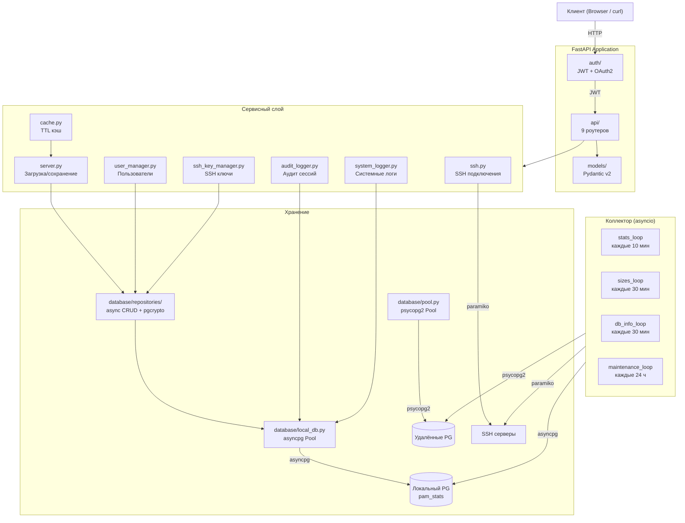

<div align="center">

# PostgreSQL Activity Monitor — Backend API


**REST API v3.0 для мониторинга PostgreSQL серверов**

</div>

---

## Архитектура



---

## Стек технологий

| Технология | Версия | Назначение |
|-----------|--------|------------|
| Python | 3.13 | Среда выполнения |
| FastAPI | >=0.115 | REST API + автодокументация (Swagger / ReDoc) |
| uvicorn | >=0.41 | ASGI-сервер |
| Pydantic | >=2.10 | Валидация данных, сериализация моделей |
| psycopg2-binary | >=2.9.10 | PostgreSQL драйвер (удалённые серверы, thread-safe pool) |
| asyncpg | >=0.30 | PostgreSQL async-драйвер (локальная БД pam_stats) |
| paramiko | >=3.5 | SSH клиент (подключения, получение disk usage) |
| PyJWT | >=2.10 | JWT токены (access + refresh, HS256) |
| bcrypt | >=4.2 | Хэширование паролей |
| cryptography | >=46.0 | Генерация SSH-ключей (RSA 4096, Ed25519) |
| slowapi | >=0.1.9 | Rate limiting (защита /api/token от brute force) |
| python-dotenv | >=1.0 | Загрузка .env конфигурации |

---

## Структура

```
backend/
├── main.py                       # Точка входа: lifespan, CORS, rate limiting, роутеры
├── requirements.txt              # Python зависимости (диапазоны версий)
├── pgmon-backend.service         # systemd unit file
├── .env                          # SECRET_KEY, ENCRYPTION_KEY, LOCAL_DB_DSN
└── app/
    ├── config.py                 # Конфигурация: JWT, CORS, pools, collector, кэш
    │
    ├── api/                      # REST endpoints (9 роутеров)
    │   ├── __init__.py           # Экспорт всех роутеров
    │   ├── auth.py               # POST /api/token, /api/refresh, /api/logout
    │   ├── servers.py            # CRUD /api/servers + test-ssh, test-pg
    │   ├── stats.py              # Статистика серверов и БД (asyncpg)
    │   ├── users.py              # CRUD /api/users (admin only)
    │   ├── ssh_keys.py           # CRUD /api/ssh-keys (admin / operator)
    │   ├── audit.py              # GET /api/audit/sessions (admin only)
    │   ├── logs.py               # GET /api/logs, /api/logs/stats (admin only)
    │   ├── settings.py           # GET/PUT /api/settings (admin only)
    │   └── health.py             # GET /api/health, /api/pools/status
    │
    ├── auth/                     # JWT авторизация
    │   ├── __init__.py           # Экспорт get_current_user
    │   ├── blacklist.py          # In-memory token blacklist (thread-safe, с cleanup)
    │   ├── dependencies.py       # get_current_user: OAuth2 + JWT decode + blacklist check
    │   └── utils.py              # Создание access/refresh токенов, verify_password
    │
    ├── collector/                # Автосбор статистики (v3)
    │   ├── scheduler.py          # 4 asyncio loops: stats, sizes, db_info, maintenance
    │   └── tasks.py              # Логика сбора: pg_stat_database, pg_database_size, disk
    │
    ├── database/
    │   ├── __init__.py           # Экспорт db_pool
    │   ├── pool.py               # DatabasePool: psycopg2 thread-safe пул (удалённые серверы)
    │   ├── local_db.py           # asyncpg pool + DDL 8 таблиц (локальная БД pam_stats)
    │   └── repositories/         # async CRUD-репозитории
    │       ├── __init__.py
    │       ├── user_repo.py      # Пользователи (bcrypt, CRUD)
    │       ├── server_repo.py    # Серверы (pgcrypto шифрование паролей)
    │       ├── ssh_key_repo.py   # SSH-ключи (pgcrypto шифрование приватных ключей)
    │       └── settings_repo.py  # Настройки (KV-хранилище)
    │
    ├── models/                   # Pydantic v2 модели
    │   ├── __init__.py           # Экспорт всех моделей
    │   ├── server.py             # Server (host, port, credentials, SSH config)
    │   ├── user.py               # User, UserCreate, UserUpdate, UserResponse, UserRole
    │   ├── ssh_key.py            # SSHKey, SSHKeyCreate, SSHKeyImport, SSHKeyResponse, SSHKeyType
    │   └── audit.py              # AuditEvent
    │
    └── services/                 # Бизнес-логика
        ├── __init__.py           # Экспорт всех сервисов
        ├── server.py             # load_servers, save_server, connect_to_server (async)
        ├── ssh.py                # get_ssh_client, get_ssh_disk_usage, is_host_reachable
        ├── cache.py              # CacheManager (thread-safe, TTL, invalidation)
        ├── user_manager.py       # CRUD пользователей, update_last_login (async, asyncpg)
        ├── ssh_key_manager.py    # Генерация SSH-ключей (RSA 4096, Ed25519), тест подключения
        ├── ssh_key_storage.py    # Хранение SSH-ключей (async, pgcrypto encrypt/decrypt)
        ├── audit_logger.py       # Аудит: log_event, get_sessions, get_stats, cleanup
        └── system_logger.py      # Логи: log, info, warning, error, get_logs, get_stats, cleanup
```

---

## Установка

```bash
# Virtual environment
python3.13 -m venv venv
source venv/bin/activate
pip install --upgrade pip
pip install -r requirements.txt

# Локальная БД
sudo -u postgres createuser pam
sudo -u postgres createdb -O pam pam_stats
sudo -u postgres psql -d pam_stats -c "CREATE EXTENSION IF NOT EXISTS pgcrypto;"

# Конфигурация (.env в корне проекта)
cat > ../.env << 'EOF'
SECRET_KEY=<your-secret-key>
ENCRYPTION_KEY=<your-encryption-key>
LOCAL_DB_DSN=postgresql://pam:pam@/pam_stats?host=/tmp
EOF
```

## Запуск

```bash
# Разработка (с hot-reload)
source venv/bin/activate
LOG_LEVEL=DEBUG uvicorn main:app --reload --host 0.0.0.0 --port 8000

# Production (systemd)
sudo cp pgmon-backend.service /etc/systemd/system/
sudo systemctl daemon-reload
sudo systemctl enable --now pgmon-backend
```

---

## API Endpoints

> Документация: `http://localhost:8000/docs` (Swagger UI) | `/redoc` (ReDoc)
>
> Все endpoints под префиксом `/api/`. Авторизация: `Authorization: Bearer <token>`

| Группа | Метод | Endpoint | Доступ | Описание |
|--------|-------|----------|--------|----------|
| **Auth** | POST | `/api/token` | — | Логин (access token + refresh cookie) |
| | POST | `/api/refresh` | — (cookie) | Обновление access token |
| | POST | `/api/logout` | авторизован | Blacklist + удаление cookie |
| **Servers** | GET | `/api/servers` | все | Список серверов с текущим статусом |
| | POST | `/api/servers` | все | Добавить сервер (проверка доступности) |
| | PUT | `/api/servers/{name}` | все | Обновить конфигурацию сервера |
| | DELETE | `/api/servers/{name}` | все | Удалить сервер + очистка данных |
| | POST | `/api/servers/{name}/test-ssh` | все | Тест SSH подключения |
| | POST | `/api/servers/{name}/test-pg` | все | Тест PostgreSQL подключения |
| **Stats** | GET | `/api/server_stats/{name}` | все | Активные запросы (pg_stat_activity) |
| | GET | `/api/server/{name}/stats` | все | Историческая статистика сервера |
| | GET | `/api/server/{name}/db/{db}` | все | Краткая информация о БД |
| | GET | `/api/server/{name}/db/{db}/stats` | все | Детальная статистика БД за период |
| **Users** | GET | `/api/users` | admin | Список пользователей |
| | POST | `/api/users` | admin | Создать пользователя |
| | GET | `/api/users/me` | все | Текущий пользователь |
| | GET / PUT / DELETE | `/api/users/{login}` | admin | CRUD пользователя |
| **SSH Keys** | GET | `/api/ssh-keys` | admin / operator | Список ключей |
| | POST | `/api/ssh-keys/generate` | admin / operator | Генерация нового ключа |
| | POST | `/api/ssh-keys/import` | admin / operator | Импорт ключа (текст) |
| | POST | `/api/ssh-keys/import-file` | admin / operator | Импорт ключа (файл) |
| | GET / PUT / DELETE | `/api/ssh-keys/{id}` | admin / operator | CRUD ключа |
| | GET | `/api/ssh-keys/{id}/servers` | все | Серверы, использующие ключ |
| | GET | `/api/ssh-keys/{id}/download-public` | admin | Скачать публичный ключ |
| **Audit** | GET | `/api/audit/sessions` | admin | Журнал событий (с фильтрами) |
| | GET | `/api/audit/sessions/stats` | admin | Статистика аудита |
| **Logs** | GET | `/api/logs` | admin | Системные логи (с фильтрами) |
| | GET | `/api/logs/stats` | admin | Статистика логов |
| **Settings** | GET | `/api/settings` | admin | Текущие настройки |
| | PUT | `/api/settings` | admin | Обновить настройки |
| **Health** | GET | `/api/health` | — | Статус API, версия, пулы |
| | GET | `/api/pools/status` | все | Статус connection pools |

---

## База данных (pam_stats)

8 таблиц, автоматически создаются при первом запуске:

| Таблица | Описание | Ключевые поля |
|---------|----------|---------------|
| `statistics` | Историческая статистика | Партиции по месяцам (RANGE по ts) |
| `db_info` | Список БД на серверах | PK: (server_name, datname) |
| `users` | Пользователи | login, password_hash, role, last_login |
| `servers` | Конфигурация серверов | password_enc, ssh_password_enc (pgcrypto) |
| `ssh_keys` | SSH-ключи | private_key_enc (pgcrypto), fingerprint |
| `audit_sessions` | Аудит действий | event_type, username, ip_address, details |
| `system_log` | Системные логи | level, source, message, details |
| `settings` | Настройки системы | key-value с типизацией |

### Расширения

- **pgcrypto** — шифрование `pgp_sym_encrypt` / `pgp_sym_decrypt` (AES-256)

### Индексы

- `idx_stats_server_ts` — statistics (server_name, ts DESC)
- `idx_stats_server_db_ts` — statistics (server_name, datname, ts DESC)
- `idx_audit_timestamp` — audit_sessions (timestamp DESC)
- `idx_audit_username` — audit_sessions (username)
- `idx_audit_event_type` — audit_sessions (event_type)
- `idx_syslog_timestamp` — system_log (timestamp DESC)
- `idx_syslog_level` — system_log (level)

---

## Конфигурация

### Переменные окружения (`.env`)

| Переменная | Обязательна | По умолчанию | Описание |
|-----------|-------------|-------------|----------|
| `SECRET_KEY` | **да** | — | Ключ для подписи JWT токенов |
| `ENCRYPTION_KEY` | **да** | — | Ключ для pgcrypto (шифрование credentials) |
| `LOCAL_DB_DSN` | нет | `postgresql://pam:pam@/pam_stats?host=/tmp` | DSN локальной БД |
| `LOG_LEVEL` | нет | `INFO` | Уровень логирования (DEBUG, INFO, WARNING, ERROR) |
| `COLLECT_INTERVAL` | нет | `600` | Интервал сбора статистики (сек) |
| `SIZE_UPDATE_INTERVAL` | нет | `1800` | Интервал обновления размеров БД (сек) |
| `DB_CHECK_INTERVAL` | нет | `1800` | Интервал проверки новых/удалённых БД (сек) |
| `RETENTION_MONTHS` | нет | `12` | Хранить данные N месяцев |

### Константы (`app/config.py`)

| Параметр | Значение | Описание |
|----------|----------|----------|
| `TOKEN_EXPIRATION` | 60 мин | Время жизни access token |
| `REFRESH_TOKEN_EXPIRATION_DAYS` | 7 дней | Время жизни refresh token |
| `AUDIT_RETENTION_DAYS` | 90 дней | Fallback для хранения аудита |
| `SERVER_STATUS_CACHE_TTL` | 5 сек | TTL кэша статуса серверов |
| `SSH_CACHE_TTL` | 30 сек | TTL кэша SSH данных |
| `POOL_CONFIGS.default` | min=1, max=5 | Пул подключений (обычные серверы) |
| `POOL_CONFIGS.high_load` | min=5, max=20 | Пул подключений (нагруженные серверы) |
| `ALLOWED_ORIGINS` | `["https://pam.cbmo.mosreg.ru"]` | CORS origins |

### Настройки в БД (таблица `settings`)

| Ключ | По умолчанию | Описание |
|------|-------------|----------|
| `collect_interval` | 600 | Интервал сбора статистики (сек) |
| `size_update_interval` | 1800 | Интервал обновления размеров БД (сек) |
| `db_check_interval` | 1800 | Интервал проверки новых/удалённых БД (сек) |
| `retention_months` | 12 | Срок хранения данных (месяцев) |
| `audit_retention_days` | 90 | Срок хранения аудита (дней) |
| `logs_retention_days` | 30 | Срок хранения логов (дней) |

---

## Коллектор

4 asyncio-задачи, запускаются при старте FastAPI приложения:

| Цикл | Интервал | Действие |
|------|----------|----------|
| `stats_loop` | 10 мин | pg_stat_database + SSH disk usage → таблица statistics |
| `sizes_loop` | 30 мин | pg_database_size для каждой БД → таблица statistics |
| `db_info_loop` | 30 мин | Синхронизация списка БД (new/removed) → таблица db_info |
| `maintenance_loop` | 24 ч | Удаление старых партиций, аудита, логов + создание новых партиций |

Все события логируются в таблицу `system_log` (доступно через `/api/logs`).

---

## Аудит

Регистрируются все значимые действия:

| Тип события | Описание |
|------------|----------|
| `login_success` | Успешный вход |
| `login_failed` | Неудачная попытка входа |
| `refresh` | Обновление токена |
| `logout` | Выход |
| `user_create` / `user_update` / `user_delete` | Управление пользователями |
| `server_create` / `server_update` / `server_delete` | Управление серверами |
| `ssh_key_create` / `ssh_key_update` / `ssh_key_delete` | Управление SSH-ключами |
| `settings_update` | Изменение настроек (с детализацией: что изменилось) |

---

## Лицензия

MIT — см. [LICENSE](../LICENSE)
