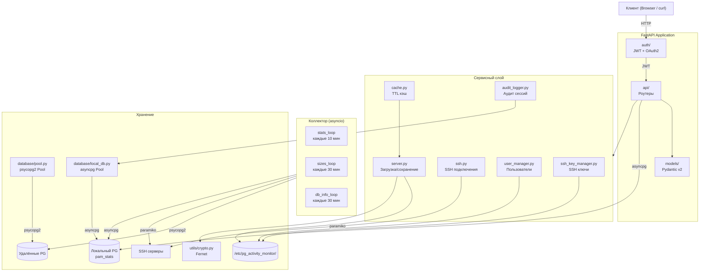

# PostgreSQL Activity Monitor — Backend API

<div align="center">


**REST API для мониторинга PostgreSQL серверов**

</div>

---

## Архитектура



## Стек

| Технология | Версия | Назначение |
|-----------|--------|------------|
| Python | 3.13 | Среда выполнения |
| FastAPI | 0.129 | REST API + автодокументация |
| uvicorn | 0.41 | ASGI-сервер |
| Pydantic | 2.12 | Валидация данных |
| psycopg2-binary | 2.9.11 | PostgreSQL (удалённые серверы) |
| asyncpg | 0.31 | PostgreSQL (локальная БД pam_stats) |
| paramiko | 3.5 | SSH клиент |
| PyJWT | 2.11 | JWT токены |
| bcrypt | 4.3 | Хэширование паролей |
| cryptography | 46.0 | Fernet шифрование |
| slowapi | 0.1.9 | Rate limiting |

## Структура

```
backend/
├── main.py                       # Точка входа FastAPI
├── requirements.txt              # Python зависимости
├── pgmon-backend.service         # systemd сервис
├── .env                          # SECRET_KEY, LOG_LEVEL
└── app/
    ├── config.py                 # Конфигурация: JWT, CORS, pools, collector
    ├── api/
    │   ├── auth.py               # POST /token, /refresh, /logout
    │   ├── servers.py            # CRUD /servers + test-ssh
    │   ├── stats.py              # Статистика серверов и БД (asyncpg)
    │   ├── users.py              # CRUD /users (admin only)
    │   ├── ssh_keys.py           # CRUD /ssh-keys (admin/operator)
    │   ├── audit.py              # GET /audit/sessions (admin)
    │   └── health.py             # /api/health, /api/pools/status
    ├── auth/
    │   ├── blacklist.py          # In-memory token blacklist (thread-safe)
    │   ├── dependencies.py       # get_current_user (OAuth2 + JWT + blacklist)
    │   └── utils.py              # access/refresh токены, пароли
    ├── collector/                 # Сбор статистики (v3)
    │   ├── scheduler.py          # asyncio loops: stats, sizes, db_info, maintenance
    │   └── tasks.py              # Логика сбора: pg_stat_database, sizes, disk, db_info
    ├── database/
    │   ├── pool.py               # DatabasePool (psycopg2, удалённые серверы)
    │   └── local_db.py           # asyncpg pool (локальная БД pam_stats)
    ├── models/                   # Pydantic v2
    │   ├── server.py             # Server
    │   ├── user.py               # User, UserCreate, UserUpdate, UserResponse
    │   ├── ssh_key.py            # SSHKey, SSHKeyCreate, SSHKeyImport
    │   └── audit.py              # AuditEvent
    ├── services/
    │   ├── server.py             # load_servers, save_servers, connect_to_server
    │   ├── ssh.py                # get_ssh_client, get_ssh_disk_usage
    │   ├── cache.py              # CacheManager (thread-safe, TTL)
    │   ├── user_manager.py       # UserManager (file-based, bcrypt, fcntl)
    │   ├── ssh_key_manager.py    # Генерация SSH ключей (RSA, Ed25519)
    │   ├── ssh_key_storage.py    # Хранение ключей (JSON + encrypted files)
    │   └── audit_logger.py       # Аудит сессий (PostgreSQL asyncpg)
    └── utils/
        └── crypto.py             # Fernet: encrypt/decrypt/ensure_encrypted
```

## Установка

```bash
# virtualenv
python3.13 -m venv venv
source venv/bin/activate
pip install --upgrade pip
pip install -r requirements.txt

# Конфигурация
sudo mkdir -p /etc/pg_activity_monitor
sudo chown $USER:$USER /etc/pg_activity_monitor

# Ключ шифрования
python3 -c "from cryptography.fernet import Fernet; print(Fernet.generate_key().decode())" \
  > /etc/pg_activity_monitor/encryption_key.key
chmod 600 /etc/pg_activity_monitor/encryption_key.key

# SECRET_KEY
echo "SECRET_KEY=$(python3 -c 'import secrets; print(secrets.token_urlsafe(32))')" > .env
```

## Запуск

```bash
# Разработка
source venv/bin/activate
LOG_LEVEL=DEBUG uvicorn main:app --reload --host 0.0.0.0 --port 8000

# Production (systemd)
sudo cp pgmon-backend.service /etc/systemd/system/
sudo systemctl daemon-reload
sudo systemctl enable --now pgmon-backend
```

## API Endpoints

Документация: `http://localhost:8000/docs`

| Группа | Метод | Endpoint | Доступ |
|--------|-------|----------|--------|
| Auth | POST | `/token` | — |
| Auth | POST | `/refresh` | — (cookie) |
| Auth | POST | `/logout` | авторизован |
| Servers | GET / POST | `/servers` | все |
| Servers | PUT / DELETE | `/servers/{name}` | все |
| Servers | POST | `/servers/{name}/test-ssh` | все |
| Stats | GET | `/server_stats/{name}` | все |
| Stats | GET | `/server/{name}/stats` | все |
| Stats | GET | `/server/{name}/db/{db}` | все |
| Stats | GET | `/server/{name}/db/{db}/stats` | все |
| Users | GET / POST | `/users` | admin |
| Users | GET | `/users/me` | все |
| Users | GET / PUT / DELETE | `/users/{login}` | admin |
| SSH Keys | GET | `/ssh-keys` | admin / operator |
| SSH Keys | POST | `/ssh-keys/generate` | admin / operator |
| SSH Keys | POST | `/ssh-keys/import` | admin / operator |
| SSH Keys | POST | `/ssh-keys/import-file` | admin / operator |
| SSH Keys | GET / PUT / DELETE | `/ssh-keys/{id}` | admin / operator |
| SSH Keys | GET | `/ssh-keys/{id}/servers` | все |
| SSH Keys | GET | `/ssh-keys/{id}/download-public` | admin |
| Audit | GET | `/audit/sessions` | admin |
| Audit | GET | `/audit/sessions/stats` | admin |
| Health | GET | `/api/health` | — |
| Health | GET | `/api/pools/status` | все |

## Конфигурация

### Параметры (`app/config.py`)

| Параметр | Значение | Описание |
|----------|----------|----------|
| `SECRET_KEY` | из .env | Ключ для JWT |
| `TOKEN_EXPIRATION` | 60 мин | Время жизни access token |
| `REFRESH_TOKEN_EXPIRATION_DAYS` | 7 дней | Время жизни refresh token |
| `AUDIT_RETENTION_DAYS` | 90 дней | Хранение записей аудита |
| `SERVER_STATUS_CACHE_TTL` | 5 сек | TTL кэша статуса серверов |
| `SSH_CACHE_TTL` | 30 сек | TTL кэша SSH данных |
| `LOCAL_DB_DSN` | из .env | DSN для локальной БД pam_stats |
| `COLLECT_INTERVAL` | 600 сек | Интервал сбора статистики |
| `SIZE_UPDATE_INTERVAL` | 1800 сек | Интервал обновления размеров БД |
| `DB_CHECK_INTERVAL` | 1800 сек | Интервал проверки новых/удалённых БД |
| `RETENTION_MONTHS` | 12 | Хранить данные N месяцев |
| `POOL_CONFIGS.default` | min=1, max=5 | Пул для удалённых серверов |
| `POOL_CONFIGS.high_load` | min=5, max=20 | Пул для нагруженных серверов |
| `ALLOWED_ORIGINS` | list | CORS origins |

### Файлы конфигурации

| Путь | Описание |
|------|----------|
| `/etc/pg_activity_monitor/servers.json` | Серверы (пароли зашифрованы Fernet) |
| `/etc/pg_activity_monitor/users.json` | Пользователи (bcrypt хэши) |
| `/etc/pg_activity_monitor/encryption_key.key` | Ключ Fernet |
| `/etc/pg_activity_monitor/ssh_keys/` | SSH-ключи (metadata + encrypted files) |
| `.env` | SECRET_KEY, LOG_LEVEL, LOCAL_DB_DSN |

## Лицензия

MIT — см. [LICENSE](../LICENSE)
