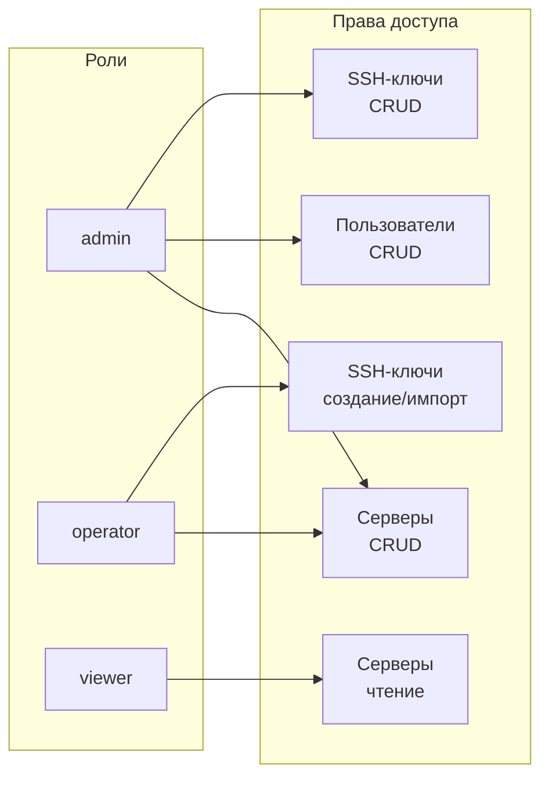

# API управления пользователями

<div align="center">


</div>

## Ролевая модель



| Роль | Серверы | Пользователи | SSH-ключи |
|------|---------|--------------|-----------|
| **admin** | Полный доступ | Полный доступ | Полный доступ |
| **operator** | Полный доступ | Нет доступа | Создание / импорт |
| **viewer** | Только чтение | Нет доступа | Нет доступа |

## Endpoints

### Текущий пользователь

```
GET /users/me
Authorization: Bearer {token}
```

**Ответ:**

```json
{
    "login": "admin",
    "role": "admin",
    "email": null,
    "created_at": null,
    "last_login": null,
    "is_active": true
}
```

### Список пользователей (admin)

```
GET /users
Authorization: Bearer {token}
```

**Ответ:**

```json
[
    {
        "login": "admin",
        "role": "admin",
        "email": null,
        "created_at": null,
        "last_login": null,
        "is_active": true
    },
    {
        "login": "operator1",
        "role": "operator",
        "email": "operator@example.com",
        "created_at": "2025-06-18T09:14:41.707282",
        "last_login": null,
        "is_active": true
    }
]
```

### Создание пользователя (admin)

```
POST /users
Authorization: Bearer {token}
Content-Type: application/json
```

```json
{
  "login": "username",
  "password": "password",
  "role": "viewer",
  "email": "email@example.com"
}
```

### Информация о пользователе (admin)

```
GET /users/{username}
Authorization: Bearer {token}
```

### Обновление пользователя (admin)

```
PUT /users/{username}
Authorization: Bearer {token}
Content-Type: application/json
```

```json
{
  "password": "new_password",
  "role": "operator",
  "email": "new@example.com",
  "is_active": true
}
```

Все поля опциональны — можно обновить только нужные.

### Удаление пользователя (admin)

```
DELETE /users/{username}
Authorization: Bearer {token}
```

```json
{
    "message": "Пользователь username удален"
}
```

## Коды ошибок

| Код | Описание |
|-----|----------|
| 400 | Неверные данные или попытка удалить себя |
| 401 | Отсутствует или невалидный токен |
| 403 | Недостаточно прав (требуется admin) |
| 404 | Пользователь не найден |

## Примеры (curl)

```bash
# Получение токена
TOKEN=$(curl -s -X POST http://localhost:8000/token \
  -d "username=admin&password=admin" \
  -H "Content-Type: application/x-www-form-urlencoded" | \
  python3 -c "import sys, json; print(json.load(sys.stdin)['access_token'])")

# Создание оператора
curl -X POST http://localhost:8000/users \
  -H "Authorization: Bearer $TOKEN" \
  -H "Content-Type: application/json" \
  -d '{"login": "operator1", "password": "secure_pass", "role": "operator"}'

# Изменение роли
curl -X PUT http://localhost:8000/users/operator1 \
  -H "Authorization: Bearer $TOKEN" \
  -H "Content-Type: application/json" \
  -d '{"role": "admin"}'

# Деактивация
curl -X PUT http://localhost:8000/users/operator1 \
  -H "Authorization: Bearer $TOKEN" \
  -H "Content-Type: application/json" \
  -d '{"is_active": false}'

# Смена пароля
curl -X PUT http://localhost:8000/users/operator1 \
  -H "Authorization: Bearer $TOKEN" \
  -H "Content-Type: application/json" \
  -d '{"password": "new_secure_password"}'

# Удаление
curl -X DELETE http://localhost:8000/users/operator1 \
  -H "Authorization: Bearer $TOKEN"
```

## Хранение

Пользователи хранятся в таблице `users` локальной БД `pam_stats` (PostgreSQL):

```sql
CREATE TABLE users (
    login         TEXT PRIMARY KEY,
    password_hash TEXT NOT NULL,          -- bcrypt
    role          TEXT NOT NULL DEFAULT 'viewer',
    email         TEXT,
    is_active     BOOLEAN NOT NULL DEFAULT true,
    created_at    TIMESTAMPTZ NOT NULL DEFAULT now(),
    updated_at    TIMESTAMPTZ,
    last_login    TIMESTAMPTZ
);
```

Пароли хранятся как bcrypt хэши. CRUD-операции выполняются через async-репозиторий `user_repo.py` (asyncpg).
