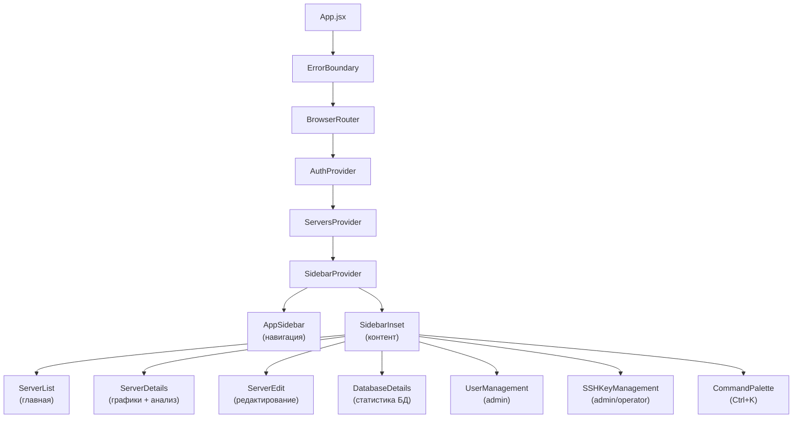
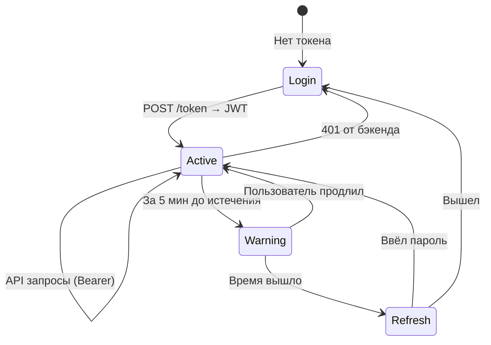

# PostgreSQL Activity Monitor — Frontend

<div align="center">


**React SPA для мониторинга PostgreSQL серверов**


</div>

---

## Архитектура



## Стек технологий

| Категория | Технология | Версия | Описание |
|-----------|-----------|--------|----------|
| UI-фреймворк | [React](https://react.dev) | 19.2 | Хуки, Context API, Error Boundaries |
| Сборщик | [Vite](https://vite.dev) | 7.3 | HMR, ESBuild + Rollup |
| CSS | [Tailwind CSS](https://tailwindcss.com) | 4.2 | Utility-first, CSS-переменные, тёмная тема |
| UI-компоненты | [shadcn/ui](https://ui.shadcn.com) | 27 шт. | Radix-примитивы + Tailwind |
| Графики | [Chart.js](https://www.chartjs.org) | 4.5 | Canvas-графики временных рядов |
| HTTP | [axios](https://axios-http.com) | 1.13 | JWT interceptors |
| Маршрутизация | [React Router](https://reactrouter.com) | 7.13 | SPA-роутинг с защитой маршрутов |
| Иконки | [Lucide React](https://lucide.dev) | 0.575 | 1500+ SVG-иконок |
| Уведомления | [Sonner](https://sonner.emilkowal.dev) | 2.0 | Toast (success / error / info) |
| Даты | [date-fns](https://date-fns.org) + react-datepicker | 4.1 / 9.1 | Форматирование, локаль ru |
| Шрифты | [Inter](https://rsms.me/inter/) + [JetBrains Mono](https://www.jetbrains.com/lp/mono/) | — | @fontsource |
| Тема | [next-themes](https://github.com/pacocoursey/next-themes) | 0.4 | Light / Dark переключение |

## Структура проекта

```
frontend/
├── index.html                  # Точка входа HTML
├── vite.config.js              # Конфигурация Vite (порт 3000, alias @/)
├── components.json             # Конфигурация shadcn/ui
├── package.json                # v2.2.0
└── src/
    ├── main.jsx                # Точка входа React
    ├── App.jsx                 # Sidebar layout, роутинг, модалы сессии
    ├── index.css               # Tailwind + CSS-переменные (Steel Blue палитра)
    │
    ├── components/             # Страницы и бизнес-компоненты
    │   ├── AppSidebar.jsx      # Sidebar навигация (серверы, пользователи, SSH)
    │   ├── CommandPalette.jsx  # Поиск по Ctrl+K (cmdk)
    │   ├── ErrorBoundary.jsx   # Обработка ошибок React
    │   ├── Login.jsx           # Форма авторизации
    │   ├── ServerList.jsx      # Главная — список серверов с фильтрами
    │   ├── ServerDetails.jsx   # Графики, таблица БД, анализ активности
    │   ├── ServerEdit.jsx      # Редактирование / добавление сервера
    │   ├── DatabaseDetails.jsx # 3 графика (подключения, размер, коммиты)
    │   ├── UserManagement.jsx  # CRUD пользователей (admin)
    │   ├── SSHKeyManagement.jsx# Генерация, импорт, управление SSH-ключами
    │   ├── PageHeader.jsx      # Заголовок + breadcrumbs
    │   ├── EmptyState.jsx      # Заглушка пустого состояния
    │   ├── LoadingSpinner.jsx  # Спиннер загрузки (Loader2)
    │   ├── ScrollToTop.jsx     # Кнопка «Наверх»
    │   ├── skeletons/          # Skeleton-загрузка
    │   │   ├── ServerListSkeleton.jsx
    │   │   └── ServerDetailsSkeleton.jsx
    │   └── ui/                 # 27 shadcn/ui компонентов
    │       ├── alert.jsx         ├── pagination.jsx
    │       ├── alert-dialog.jsx  ├── popover.jsx
    │       ├── avatar.jsx        ├── progress.jsx
    │       ├── badge.jsx         ├── radio-group.jsx
    │       ├── breadcrumb.jsx    ├── select.jsx
    │       ├── button.jsx        ├── separator.jsx
    │       ├── card.jsx          ├── sheet.jsx
    │       ├── collapsible.jsx   ├── sidebar.jsx
    │       ├── command.jsx       ├── skeleton.jsx
    │       ├── dialog.jsx        ├── sonner.jsx
    │       ├── dropdown-menu.jsx ├── switch.jsx
    │       ├── input.jsx         ├── table.jsx
    │       ├── label.jsx         ├── tabs.jsx
    │       └── tooltip.jsx
    │
    ├── contexts/
    │   ├── auth-context.jsx    # AuthProvider — JWT lifecycle, auto-refresh
    │   └── servers-context.jsx # ServersProvider — глобальный список серверов
    │
    ├── hooks/
    │   ├── use-auth.js         # useAuth() — доступ к AuthContext
    │   ├── use-servers.js      # useServers() — доступ к ServersContext
    │   └── use-mobile.js       # useMobile() — responsive breakpoint
    │
    └── lib/
        ├── api.js              # Axios instance + JWT interceptors
        ├── chart-config.js     # Chart.js: цвета из CSS-переменных, опции, градиенты
        ├── constants.js        # Все константы (интервалы, пагинация, ключи LS)
        ├── format.js           # Форматирование: bytes, uptime, даты, таймер
        ├── validation.js       # Валидация: hostname, port
        └── utils.js            # cn() — утилита для CSS-классов (tailwind-merge)
```

## Маршруты

| Путь | Компонент | Доступ | Описание |
|------|-----------|--------|----------|
| `/` | `ServerList` | все | Список серверов с поиском и фильтрами |
| `/server/:name` | `ServerDetails` | все | Графики, таблица БД, анализ активности |
| `/server/:name/edit` | `ServerEdit` | admin, operator | Редактирование параметров сервера |
| `/server/:name/db/:db_name` | `DatabaseDetails` | все | Графики подключений, размера, коммитов |
| `/users` | `UserManagement` | admin | Управление пользователями |
| `/ssh-keys` | `SSHKeyManagement` | admin, operator | Управление SSH-ключами |

## Быстрый старт

```bash
npm install       # Установка зависимостей
npm run dev       # Dev-сервер (порт 3000)
npm run build     # Production-сборка
npm run preview   # Предпросмотр сборки
```

## Конфигурация

### Vite (`vite.config.js`)

| Параметр | Значение |
|----------|----------|
| Порт | 3000 |
| Alias | `@` → `./src/` |
| allowedHosts | `pam.cbmo.mosreg.ru` |
| Build output | `build/` |

### Дизайн-система

Палитра **Steel Blue** с HSL CSS-переменными. Полное описание: [`docs/DESIGN_SYSTEM.md`](../docs/DESIGN_SYSTEM.md)

- Кастомные CSS-переменные для light и dark режимов
- Статусные цвета: `--status-active`, `--status-warning`, `--status-danger`, `--status-info`
- Графики: `--chart-1` ... `--chart-5`
- Sidebar: `--sidebar-background`, `--sidebar-foreground`, `--sidebar-accent`

### API

URL бэкенда определяется через `window.location.origin`. В production Nginx проксирует API на порт 8000.

## Ключевые паттерны

### Авторизация



`AuthContext` управляет полным жизненным циклом JWT:
1. Логин через `POST /token` → токен в `localStorage`
2. Axios interceptor добавляет `Authorization: Bearer` header
3. За 5 минут до истечения — модалка «Продлить сессию»
4. При истечении — повторный ввод пароля
5. При 401 — автоматический выход

### UI-паттерны

| Паттерн | Реализация |
|---------|-----------|
| Навигация | Sidebar (AppSidebar) с SidebarProvider |
| Быстрый поиск | CommandPalette (`Ctrl+K`) |
| Уведомления | `toast()` из sonner |
| Подтверждение удаления | `AlertDialog` |
| Загрузка страниц | Skeleton-компоненты |
| Обработка ошибок | ErrorBoundary |
| Статусы | Badge с CSS-переменными цветов |
| Таблицы | shadcn Table + Pagination |
| Тёмная тема | next-themes + CSS-переменные |

## Деплой

Frontend запускается как systemd-сервис `pgmon-frontend`:

```bash
sudo systemctl status pgmon-frontend    # Статус
sudo systemctl restart pgmon-frontend   # Перезапуск
```

Nginx проксирует `https://domain:443` → `localhost:3000` (frontend) и API → `localhost:8000` (backend).

## Добавление shadcn/ui компонентов

```bash
npx shadcn@latest add <component-name>
```

Компоненты устанавливаются в `src/components/ui/`. Каталог: https://ui.shadcn.com/docs/components

## Лицензия

MIT — см. [LICENSE](../LICENSE)
