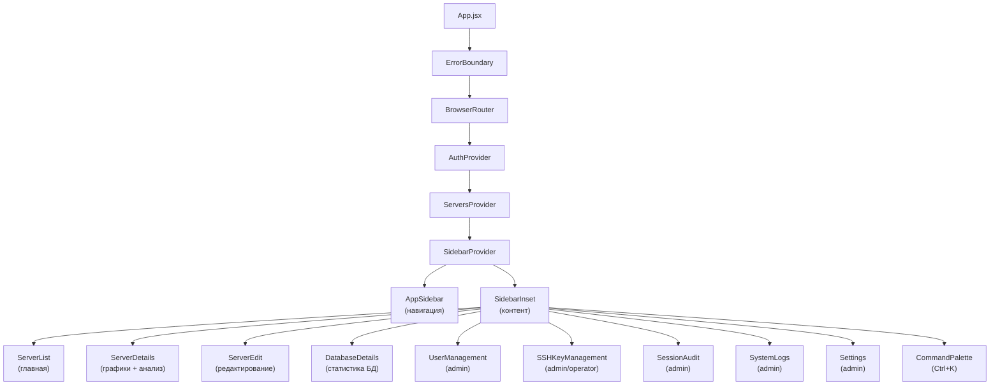
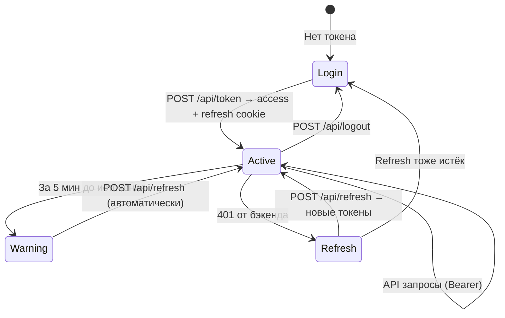

<div align="center">

# PostgreSQL Activity Monitor — Frontend


**React SPA для мониторинга PostgreSQL серверов**


</div>

---

## Архитектура



---

## Стек технологий

| Категория | Технология | Версия | Описание |
|-----------|-----------|--------|----------|
| UI-фреймворк | [React](https://react.dev) | 19.2 | Хуки, Context API, Error Boundaries |
| Сборщик | [Vite](https://vite.dev) | 7.3 | HMR, ESBuild + Rollup |
| CSS | [Tailwind CSS](https://tailwindcss.com) | 4.2 | Utility-first, CSS-переменные, тёмная тема |
| UI-компоненты | [shadcn/ui](https://ui.shadcn.com) | 27 шт. | Radix-примитивы + Tailwind |
| Графики | [Chart.js](https://www.chartjs.org) | 4.5 | Canvas-графики временных рядов |
| HTTP | [axios](https://axios-http.com) | 1.13 | JWT interceptors + auto-refresh queue |
| Маршрутизация | [React Router](https://reactrouter.com) | 7.13 | SPA-роутинг с защитой маршрутов по ролям |
| Иконки | [Lucide React](https://lucide.dev) | 0.575 | 1500+ SVG-иконок |
| Уведомления | [Sonner](https://sonner.emilkowal.dev) | 2.0 | Toast (success / error / info) |
| Даты | [date-fns](https://date-fns.org) + react-datepicker | 4.1 / 9.1 | Форматирование, локаль ru |
| Шрифты | [Inter](https://rsms.me/inter/) + [JetBrains Mono](https://www.jetbrains.com/lp/mono/) | — | @fontsource (основной + моноширинный) |
| Тема | [next-themes](https://github.com/pacocoursey/next-themes) | 0.4 | Light / Dark переключение |
| Command Palette | [cmdk](https://cmdk.paco.me) | 1.1 | Быстрый поиск по Ctrl+K |

---

## Структура проекта

```
frontend/
├── index.html                  # Точка входа HTML
├── vite.config.js              # Конфигурация Vite (порт 3000, alias @/)
├── components.json             # Конфигурация shadcn/ui (zinc theme, CSS variables)
├── package.json                # v3.0.0
└── src/
    ├── main.jsx                # Точка входа React
    ├── App.jsx                 # Sidebar layout, роутинг, модалы сессии
    ├── index.css               # Tailwind + CSS-переменные (Steel Blue палитра)
    │
    ├── components/             # Страницы и бизнес-компоненты
    │   ├── AppSidebar.jsx      # Sidebar навигация (по ролям, тема, logout)
    │   ├── CommandPalette.jsx  # Поиск по Ctrl+K (cmdk)
    │   ├── ErrorBoundary.jsx   # Обработка ошибок React
    │   ├── Login.jsx           # Форма авторизации (с проверкой доступности бэкенда)
    │   ├── ServerList.jsx      # Главная — карточки серверов с фильтрами
    │   ├── ServerDetails.jsx   # Графики нагрузки, таблица БД, анализ активности
    │   ├── ServerEdit.jsx      # Редактирование / добавление сервера (PG + SSH конфиг)
    │   ├── DatabaseDetails.jsx # 3 графика: подключения, размер, коммиты
    │   ├── UserManagement.jsx  # CRUD пользователей (admin)
    │   ├── SSHKeyManagement.jsx# Генерация, импорт, управление SSH-ключами
    │   ├── SessionAudit.jsx    # Журнал аудита (фильтры, пагинация, статистика)
    │   ├── SystemLogs.jsx      # Системные логи (фильтры, пагинация, статистика)
    │   ├── Settings.jsx        # Настройки: интервалы коллектора, сроки хранения
    │   ├── PageHeader.jsx      # Заголовок + breadcrumbs
    │   ├── EmptyState.jsx      # Заглушка пустого состояния
    │   ├── LoadingSpinner.jsx  # Спиннер загрузки (Loader2)
    │   ├── ScrollToTop.jsx     # Кнопка «Наверх»
    │   ├── skeletons/          # Skeleton-загрузка
    │   │   ├── ServerListSkeleton.jsx
    │   │   └── ServerDetailsSkeleton.jsx
    │   └── ui/                 # 27 shadcn/ui компонентов
    │       ├── alert.jsx         ├── pagination.jsx
    │       ├── alert-dialog.jsx  ├── popover.jsx
    │       ├── avatar.jsx        ├── progress.jsx
    │       ├── badge.jsx         ├── radio-group.jsx
    │       ├── breadcrumb.jsx    ├── select.jsx
    │       ├── button.jsx        ├── separator.jsx
    │       ├── card.jsx          ├── sheet.jsx
    │       ├── collapsible.jsx   ├── sidebar.jsx
    │       ├── command.jsx       ├── skeleton.jsx
    │       ├── dialog.jsx        ├── sonner.jsx
    │       ├── dropdown-menu.jsx ├── switch.jsx
    │       ├── input.jsx         ├── table.jsx
    │       ├── label.jsx         ├── tabs.jsx
    │       └── tooltip.jsx
    │
    ├── contexts/
    │   ├── auth-context.jsx    # AuthProvider — JWT lifecycle, cookie-based refresh
    │   └── servers-context.jsx # ServersProvider — глобальный список серверов
    │
    ├── hooks/
    │   ├── use-auth.js         # useAuth() — доступ к AuthContext
    │   ├── use-servers.js      # useServers() — доступ к ServersContext
    │   └── use-mobile.js       # useMobile() — responsive breakpoint (768px)
    │
    └── lib/
        ├── api.js              # Axios instance + JWT interceptors + auto-refresh queue
        ├── chart-config.js     # Chart.js: цвета из CSS-переменных, опции, градиенты
        ├── constants.js        # Все константы (интервалы, пагинация, ключи localStorage)
        ├── format.js           # Форматирование: bytes, uptime, даты, таймер сессии
        ├── validation.js       # Валидация: hostname, port
        └── utils.js            # cn() — утилита CSS-классов (clsx + tailwind-merge)
```

---

## Маршруты

| Путь | Компонент | Доступ | Описание |
|------|-----------|--------|----------|
| `/` | `ServerList` | все | Список серверов с поиском и фильтрами |
| `/server/:name` | `ServerDetails` | все | Графики, таблица БД, анализ активности |
| `/server/:serverName/edit` | `ServerEdit` | admin, operator | Редактирование параметров сервера |
| `/server/:name/db/:db_name` | `DatabaseDetails` | все | Графики подключений, размера, коммитов |
| `/users` | `UserManagement` | admin | Управление пользователями |
| `/ssh-keys` | `SSHKeyManagement` | admin, operator | Управление SSH-ключами |
| `/audit` | `SessionAudit` | admin | Журнал аудита сессий и действий |
| `/logs` | `SystemLogs` | admin | Системные логи коллектора |
| `/settings` | `Settings` | admin | Настройки системы |

---

## Навигация (Sidebar)

| Пункт | Иконка | Путь | Доступ |
|-------|--------|------|--------|
| Серверы | `Server` | `/` | все |
| Пользователи | `Users` | `/users` | admin |
| SSH-ключи | `KeyRound` | `/ssh-keys` | admin, operator |
| Аудит | `ClipboardList` | `/audit` | admin |
| Логи | `ScrollText` | `/logs` | admin |
| Настройки | `Settings` | `/settings` | admin |
| Поиск | `Search` | — | все (Ctrl+K) |

В футере: имя пользователя, роль, переключатель темы, кнопка выхода.

---

## Быстрый старт

```bash
npm install       # Установка зависимостей
npm run dev       # Dev-сервер (порт 3000)
npm run build     # Production-сборка (output: build/)
npm run preview   # Предпросмотр сборки
```

---

## Конфигурация

### Vite (`vite.config.js`)

| Параметр | Значение |
|----------|----------|
| Порт | 3000 |
| Alias | `@` → `./src/` |
| allowedHosts | `pam.cbmo.mosreg.ru` |
| Build output | `build/` |
| Plugins | `@vitejs/plugin-react`, `@tailwindcss/vite` |

### API

URL бэкенда определяется автоматически через `window.location.origin`. В production Nginx проксирует `/api/` на порт 8000.

### Дизайн-система

Палитра **Steel Blue** с HSL CSS-переменными. Полное описание: [`docs/DESIGN_SYSTEM.md`](../docs/DESIGN_SYSTEM.md)

| Тема | Фон | Текст | Акцент |
|------|-----|-------|--------|
| Light | `hsl(210, 40%, 98%)` | `hsl(222.2, 84%, 4.9%)` | `hsl(210, 40%, 96.1%)` |
| Dark | `hsl(222.2, 40%, 6%)` | `hsl(210, 40%, 98%)` | `hsl(217.2, 32.6%, 15%)` |

Утилитарные CSS-классы для статусов:
- `text-status-active` / `bg-status-active/10` — активный (зелёный)
- `text-status-danger` / `bg-status-danger/10` — ошибка (красный)
- `text-status-warning` / `bg-status-warning/10` — предупреждение (жёлтый)
- `text-status-idle` — неактивный (голубой)

---

## Ключевые паттерны

### Авторизация (JWT lifecycle)



`AuthContext` управляет полным жизненным циклом JWT:
1. **Логин** — `POST /api/token` → access token в `localStorage`, refresh в httpOnly cookie
2. **Axios interceptor** — автоматически добавляет `Authorization: Bearer` header
3. **Предупреждение** — за 5 минут до истечения → модалка «Продлить сессию»
4. **Auto-refresh** — при 401 → автоматический `POST /api/refresh` (очередь запросов)
5. **Logout** — `POST /api/logout` (blacklist обоих токенов, удаление cookie)

### UI-паттерны

| Паттерн | Реализация |
|---------|-----------|
| Навигация | Sidebar (AppSidebar) с SidebarProvider, коллапс |
| Быстрый поиск | CommandPalette (`Ctrl+K`) — серверы, страницы |
| Уведомления | `toast()` из Sonner (richColors, top-right) |
| Подтверждение удаления | `AlertDialog` (shadcn/ui) |
| Загрузка страниц | Skeleton-компоненты |
| Загрузка таблиц | Overlay spinner (не блокирует фильтры) |
| Обработка ошибок | ErrorBoundary (React) |
| Статусы | Badge с CSS-переменными цветов |
| Фильтры | По кнопке "Найти" + Enter (не debounce) |
| Таблицы | shadcn Table + собственная пагинация |
| Тёмная тема | next-themes + CSS-переменные |
| ARIA | Labels на всех icon-only кнопках |

---

## Деплой

Frontend запускается как systemd-сервис `pgmon-frontend`:

```bash
sudo systemctl status pgmon-frontend    # Статус
sudo systemctl restart pgmon-frontend   # Перезапуск
sudo journalctl -u pgmon-frontend -f    # Логи
```

Nginx проксирует `https://domain:443` → `localhost:3000` (frontend) и `/api/` → `localhost:8000` (backend).

## Добавление shadcn/ui компонентов

```bash
npx shadcn@latest add <component-name>
```

Компоненты устанавливаются в `src/components/ui/`. Каталог: https://ui.shadcn.com/docs/components

---

## Лицензия

MIT — см. [LICENSE](../LICENSE)
