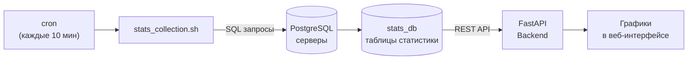
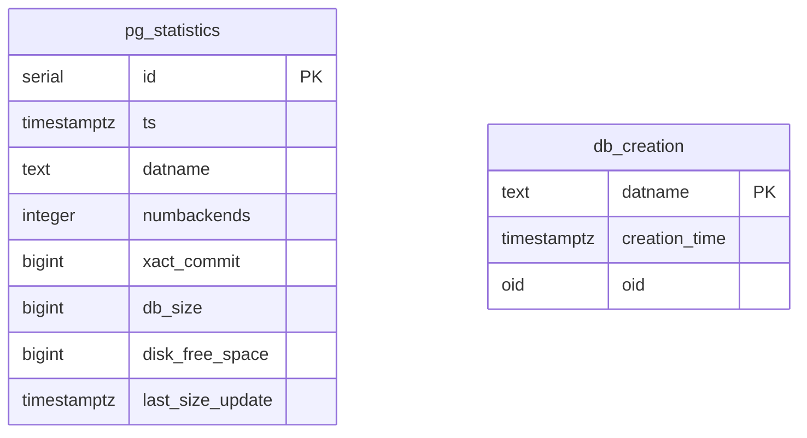

# PostgreSQL Stats Collector

<div align="center">


**Автоматический сбор статистики PostgreSQL серверов**

Часть проекта [PostgreSQL Activity Monitor](https://github.com/wobujidao/PostgreSQL-Activity-Monitor)

</div>

---

## Как это работает



## Собираемые метрики

- Количество активных подключений к каждой БД
- Размеры баз данных (обновляется раз в 30 минут)
- Количество транзакций (commits)
- Свободное место на диске
- Даты создания баз данных
- OID баз для отслеживания пересозданий

## Возможности

- Автоматический сбор каждые 10 минут через cron
- Оптимизированное обновление размеров БД (раз в 30 минут)
- Защита от одновременного запуска (lock-файл)
- Отслеживание пересозданных БД по OID
- Автоматическая очистка данных старше 1 года
- Мониторинг всех БД включая системные
- Подробное логирование с ротацией

## Компоненты

### create_stats_db.sh (v2.1)

Создание и обновление структуры БД:
- Создаёт базу данных `stats_db`
- Создаёт таблицы `pg_statistics` и `db_creation`
- Добавляет необходимые индексы
- Обновляет структуру существующих таблиц

### stats_collection.sh (v2.0)

Основной скрипт сбора:
- Собирает метрики каждые 10 минут
- Обновляет размеры БД каждые 30 минут
- Отслеживает новые и удалённые БД
- Ведёт лог операций

## Требования

- **ОС:** Linux (Debian / Ubuntu / Astra Linux)
- **PostgreSQL:** 14+ (возможна работа на более ранних версиях)
- **Доступ:** Запуск от пользователя `postgres`
- **Права:** Запись в `/tmp` и `/var/log`

## Установка

### 1. Клонирование

```bash
git clone https://github.com/wobujidao/PostgreSQL-Activity-Monitor.git
cd PostgreSQL-Activity-Monitor/stats_db
```

### 2. Копирование скриптов

```bash
sudo cp create_stats_db.sh stats_collection.sh /usr/local/bin/
sudo chmod +x /usr/local/bin/create_stats_db.sh
sudo chmod +x /usr/local/bin/stats_collection.sh
```

### 3. Инициализация базы данных

```bash
sudo -u postgres /usr/local/bin/create_stats_db.sh
```

Вывод:

```
=== Начало работы скрипта create_stats_db.sh ===
Версия: 2.1

[1/5] Проверка подключения к PostgreSQL... ✓
[2/5] Проверяем наличие базы данных 'stats_db'... ✓
[3/5] Создаём/проверяем основные таблицы... ✓
[4/5] Обновляем структуру таблицы db_creation... ✓
[5/5] Проверяем результат... ✓

=== Скрипт завершён успешно ===
```

### 4. Настройка cron

```bash
sudo crontab -u postgres -e

# Добавить строку:
*/10 * * * * /usr/local/bin/stats_collection.sh
```

### 5. Проверка

```bash
# Ручной запуск
sudo -u postgres /usr/local/bin/stats_collection.sh

# Просмотр лога
sudo tail -f /var/log/pg_stats.log

# Проверка данных
sudo -u postgres psql -d stats_db -c "
  SELECT datname, ts, numbackends, db_size
  FROM pg_statistics
  ORDER BY ts DESC
  LIMIT 10;"
```

## Структура базы данных



### Таблица `pg_statistics`

| Поле | Тип | Описание |
|------|-----|----------|
| id | serial | Уникальный идентификатор |
| ts | timestamptz | Время сбора статистики |
| datname | text | Имя базы данных |
| numbackends | integer | Количество активных подключений |
| xact_commit | bigint | Завершённые транзакции |
| db_size | bigint | Размер БД в байтах |
| disk_free_space | bigint | Свободное место на диске |
| last_size_update | timestamptz | Время последнего обновления размера |

### Таблица `db_creation`

| Поле | Тип | Описание |
|------|-----|----------|
| datname | text | Имя базы данных (PK) |
| creation_time | timestamptz | Время создания БД |
| oid | oid | OID базы данных |

## Примеры запросов

### Последняя статистика по всем БД

```sql
SELECT DISTINCT ON (datname)
  datname, ts, numbackends,
  pg_size_pretty(db_size) as size
FROM pg_statistics
ORDER BY datname, ts DESC;
```

### История подключений за 24 часа

```sql
SELECT
  date_trunc('hour', ts) as hour,
  datname,
  AVG(numbackends) as avg_connections
FROM pg_statistics
WHERE ts > now() - interval '24 hours'
GROUP BY hour, datname
ORDER BY hour, datname;
```

### Топ-10 БД по размеру

```sql
SELECT
  datname,
  pg_size_pretty(db_size) as size,
  last_size_update
FROM pg_statistics
WHERE (datname, ts) IN (
  SELECT datname, MAX(ts)
  FROM pg_statistics
  WHERE db_size IS NOT NULL
  GROUP BY datname
)
ORDER BY db_size DESC NULLS LAST
LIMIT 10;
```

## Решение проблем

### Ошибка «Отказано в доступе» для lock-файла

```bash
ls -la /tmp/pg_stats_collection.lock
# Удалите если процесс не запущен:
sudo rm -f /tmp/pg_stats_collection.lock
```

### Скрипт выполняется долго

Обновление OID может занять время при большом количестве БД. Это нормально при первом запуске.

### Не обновляются размеры БД

Размеры обновляются раз в 30 минут:

```sql
SELECT datname, MAX(last_size_update)
FROM pg_statistics
WHERE last_size_update IS NOT NULL
GROUP BY datname;
```

## Лицензия

MIT — см. [LICENSE](../LICENSE)

## Автор

**Владислав Демидов** — [@wobujidao](https://github.com/wobujidao)
